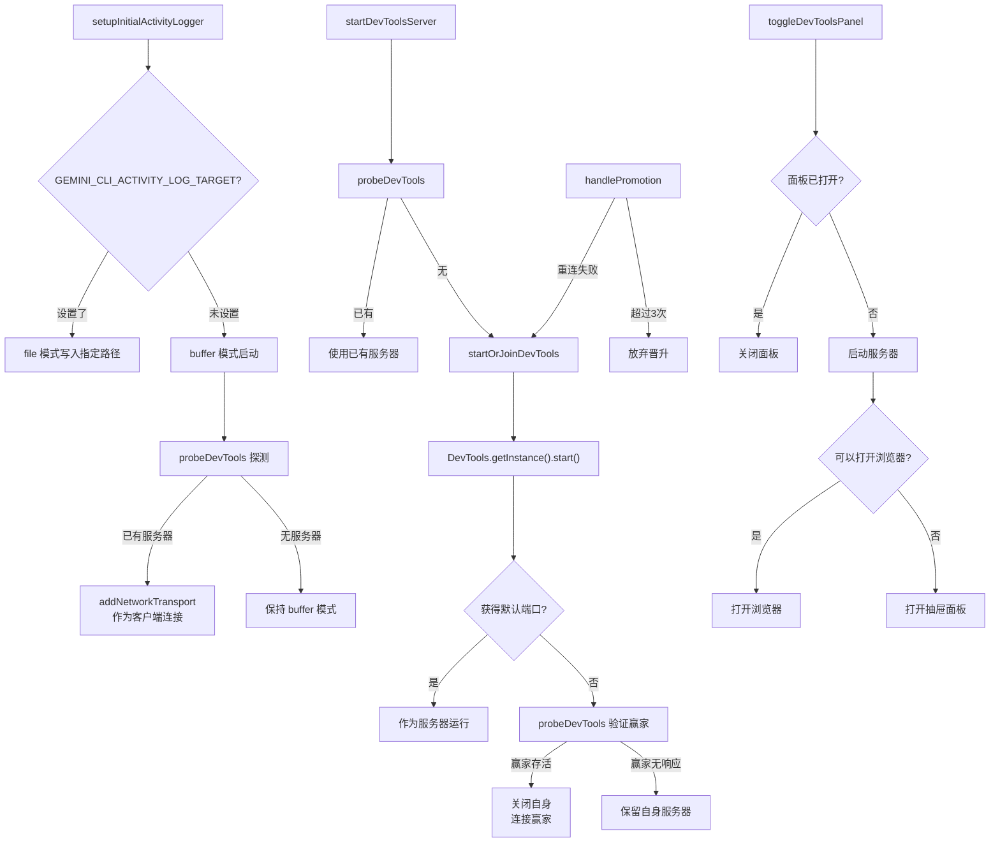

# devtoolsService.ts

> 管理 DevTools 开发者工具服务的生命周期，包括服务端启动、多实例竞争、客户端连接和 F12 面板切换。

## 概述

`devtoolsService.ts` 是 DevTools 调试工具的服务编排层。它负责启动 DevTools 服务器（或加入已有实例）、将 ActivityLogger 从缓冲模式晋升到 WebSocket 网络传输模式、处理断线重连失败后的自动晋升（从客户端变为服务端）、以及 F12 快捷键的面板切换逻辑。

该模块通过端口竞争机制实现多 CLI 实例的自动协调——第一个获取默认端口的实例成为 DevTools 服务器，后续实例检测到已有服务器后作为客户端连接。

## 架构图（mermaid）

## 主要导出

| 导出名称 | 类型 | 描述 |
|---------|------|------|
| `setupInitialActivityLogger(config)` | 异步函数 | 初始化活动日志记录器，根据环境变量选择 file 或 buffer 模式，并探测已有 DevTools 服务 |
| `startDevToolsServer(config)` | 函数 | 启动 DevTools 服务器（去重并发调用），返回 URL |
| `toggleDevToolsPanel(config, isOpen, toggle, setOpen)` | 异步函数 | 处理 F12 面板切换逻辑 |
| `resetForTesting()` | 函数 | 重置模块级状态（仅测试用） |

## 核心逻辑

### 端口竞争（startOrJoinDevTools）

1. 调用 `DevTools.getInstance().start()` 尝试启动服务器
2. 如果获得的端口是默认端口（25417），说明赢得竞争，作为服务器运行
3. 如果端口不同，说明默认端口被其他实例占用：
   - 用 WebSocket 探测默认端口上的服务是否存活
   - 存活则关闭自身，连接到赢家
   - 不存活则保留自身服务器

### WebSocket 探测（probeDevTools）

创建 WebSocket 连接到 `ws://{host}:{port}/ws`，设置 500ms 超时。若握手成功返回 `true`，否则返回 `false`。

### 晋升机制（handlePromotion）

当 WebSocket 重连失败时自动触发，尝试从客户端晋升为服务端。最多尝试 3 次（`MAX_PROMOTION_ATTEMPTS`）。

### F12 面板切换

- 面板已打开：直接 toggle 关闭
- 面板未打开：启动 DevTools 服务器，优先尝试打开浏览器；若浏览器打开失败则打开内嵌抽屉面板

## 内部依赖

| 模块 | 用途 |
|------|------|
| `@google/gemini-cli-core` | `debugLogger`（调试日志）、`Config` 类型、`openBrowserSecurely`/`shouldLaunchBrowser`（浏览器打开） |
| `./activityLogger.js` | `initActivityLogger`、`addNetworkTransport`、`ActivityLogger` 单例 |

## 外部依赖

| 模块 | 用途 |
|------|------|
| `ws` | WebSocket 客户端（用于端口探测） |
| `@google/gemini-cli-devtools` | DevTools 服务器实现（动态导入） |
