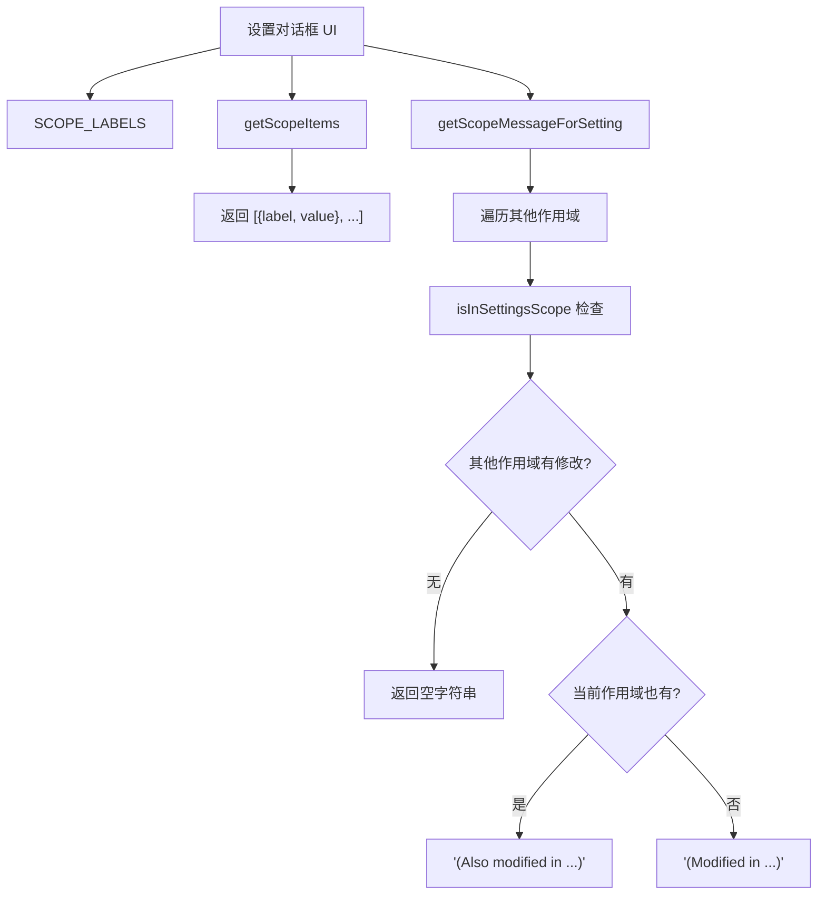

# dialogScopeUtils.ts

> 为设置对话框提供作用域标签、选项列表和跨作用域修改提示信息的工具函数。

## 概述

`dialogScopeUtils.ts` 是面向 UI 对话框组件的辅助模块，提供三个核心功能：统一的作用域显示标签（`SCOPE_LABELS`）、用于单选按钮的作用域选项列表（`getScopeItems`）、以及某个设置项在其他作用域中是否被修改的提示消息生成（`getScopeMessageForSetting`）。

这些工具函数将作用域相关的 UI 逻辑集中管理，确保设置对话框中显示的标签和提示信息的一致性。

## 架构图（mermaid）

## 主要导出

| 导出名称 | 类型 | 描述 |
|---------|------|------|
| `SCOPE_LABELS` | 常量对象 | 作用域到显示标签的映射：User -> "User Settings"，Workspace -> "Workspace Settings"，System -> "System Settings" |
| `getScopeItems()` | 函数 | 返回适用于单选按钮的作用域选项数组 `{label, value}[]` |
| `getScopeMessageForSetting(settingKey, selectedScope, settings)` | 函数 | 生成指定设置在其他作用域被修改的提示消息 |

## 核心逻辑

### getScopeMessageForSetting

1. 获取除当前选中作用域外的所有可加载作用域
2. 使用 `isInSettingsScope` 检查设置键是否在这些作用域中存在
3. 如果在其他作用域中存在修改：
   - 当前作用域也有该设置 -> `"(Also modified in User, Workspace)"`
   - 当前作用域没有 -> `"(Modified in User, Workspace)"`
4. 如果其他作用域均未修改 -> 返回空字符串

## 内部依赖

| 模块 | 用途 |
|------|------|
| `../config/settings.js` | `SettingScope`、`isLoadableSettingScope`、`LoadableSettingScope`、`Settings` 类型 |
| `./settingsUtils.js` | `isInSettingsScope` 检查设置是否存在于某作用域 |

## 外部依赖

无。
