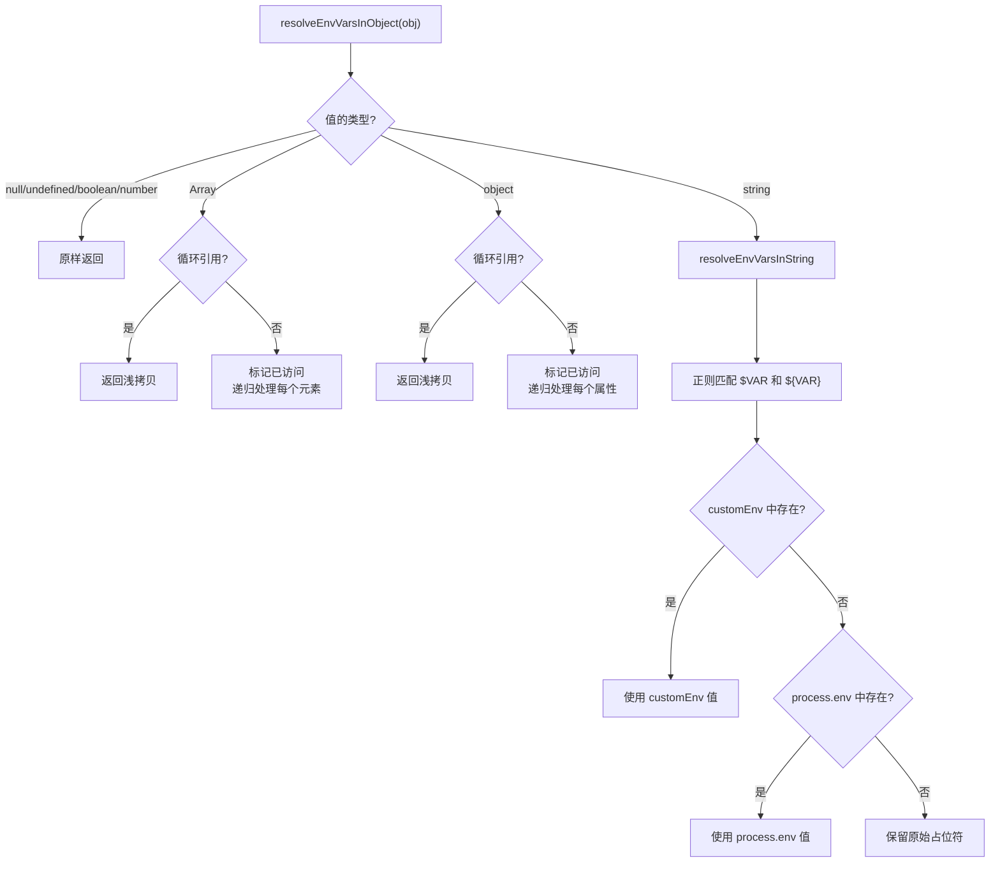

# envVarResolver.ts

> 递归解析字符串和对象中的环境变量占位符（`$VAR` 和 `${VAR}`），支持循环引用保护。

## 概述

`envVarResolver.ts` 提供了两个层次的环境变量解析功能：字符串级别的 `resolveEnvVarsInString` 和对象级别的 `resolveEnvVarsInObject`。它使用正则表达式匹配 `$VAR_NAME` 和 `${VAR_NAME}` 两种格式的占位符，优先从自定义环境对象中查找值，再回退到 `process.env`。如果环境变量未定义，则保留原始占位符不替换。

对象级别的解析使用 `WeakSet` 追踪已访问对象，防止循环引用导致无限递归。

## 架构图（mermaid）

## 主要导出

| 导出名称 | 类型 | 描述 |
|---------|------|------|
| `resolveEnvVarsInString(value, customEnv?)` | 函数 | 替换字符串中的环境变量占位符 |
| `resolveEnvVarsInObject<T>(obj, customEnv?)` | 函数 | 递归替换对象中所有字符串值的环境变量占位符 |

## 核心逻辑

### resolveEnvVarsInString

使用正则 `/\$(?:(\w+)|{([^}]+)})/g` 同时匹配 `$VAR_NAME`（`\w+`）和 `${VAR_NAME}`（`{[^}]+}`）两种格式。替换顺序：自定义环境 > process.env > 保留原文。

### resolveEnvVarsInObject

内部实现 `resolveEnvVarsInObjectInternal` 使用 `WeakSet` 追踪已访问对象：
- **基本类型**（null、undefined、boolean、number）：直接返回
- **字符串**：调用 `resolveEnvVarsInString`
- **数组**：检查循环引用，标记后递归处理每个元素，处理完取消标记
- **对象**：检查循环引用，标记后递归处理每个自有属性，处理完取消标记
- **循环引用**：返回浅拷贝以打破循环

## 内部依赖

无。

## 外部依赖

无。
