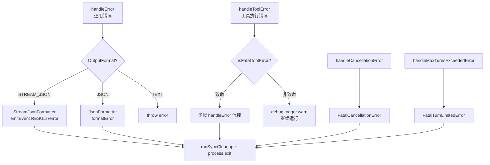

# errors.ts

> 统一处理 CLI 中的各类错误，根据输出格式（JSON/StreamJSON/Text）生成对应的错误响应并退出进程。

## 概述

`errors.ts` 是 CLI 的集中式错误处理模块，提供四个针对不同场景的错误处理函数。每个函数都根据当前的输出格式（`OutputFormat`）选择合适的错误格式化方式——JSON 模式输出结构化错误对象、流式 JSON 模式发射错误事件、文本模式直接抛出或打印错误消息。所有致命错误都会先执行同步清理（`runSyncCleanup`）再退出进程。

该模块特别区分了工具执行错误的致命/非致命级别：致命错误（如磁盘空间不足）立即退出，非致命错误（如无效参数、文件未找到）记录日志后允许模型自我纠正。

## 架构图（mermaid）

## 主要导出

| 导出名称 | 类型 | 描述 |
|---------|------|------|
| `handleError(error, config, customErrorCode?)` | 函数 | 处理通用错误，JSON 模式退出进程，文本模式重新抛出（返回类型 `never`） |
| `handleToolError(toolName, toolError, config, errorType?, resultDisplay?)` | 函数 | 处理工具执行错误，区分致命/非致命 |
| `handleCancellationError(config)` | 函数 | 处理用户取消操作（返回类型 `never`） |
| `handleMaxTurnsExceededError(config)` | 函数 | 处理达到最大会话轮次限制（返回类型 `never`） |

## 核心逻辑

### handleError

1. 使用 `parseAndFormatApiError` 格式化错误消息（支持 API 错误的特殊解析）
2. 根据输出格式：
   - `STREAM_JSON`：构造 `RESULT` 事件，含 `status: 'error'` 和统计信息
   - `JSON`：使用 `JsonFormatter.formatError` 生成结构化输出
   - 文本模式：直接 `throw error`（调用方需 catch）
3. 错误码提取优先级：`exitCode` > `code` > `status` > 默认 `1`

### handleToolError

- **致命错误**（`isFatalToolError` 返回 `true`，如 `NO_SPACE_LEFT`）：构造 `FatalToolExecutionError`，按输出格式处理后 `process.exit`
- **非致命错误**（如 `INVALID_TOOL_PARAMS`、`FILE_NOT_FOUND`）：仅 `debugLogger.warn` 记录，不退出进程，允许模型重试

### handleCancellationError / handleMaxTurnsExceededError

分别构造 `FatalCancellationError` 和 `FatalTurnLimitedError`，三种输出格式均以对应的 `exitCode` 退出进程。

## 内部依赖

| 模块 | 用途 |
|------|------|
| `@google/gemini-cli-core` | `OutputFormat`、`JsonFormatter`、`StreamJsonFormatter`、`JsonStreamEventType`、`uiTelemetryService`、`parseAndFormatApiError`、`FatalTurnLimitedError`/`FatalCancellationError`/`FatalToolExecutionError`、`isFatalToolError`、`debugLogger`、`coreEvents`、`getErrorMessage`、`Config` |
| `./cleanup.js` | `runSyncCleanup` 同步清理 |

## 外部依赖

无。
