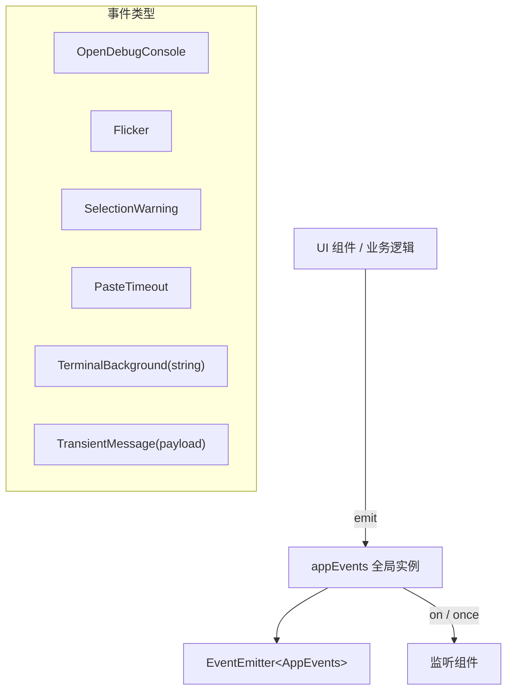

# events.ts

> 定义应用级别的事件枚举和类型安全的全局事件发射器，用于 UI 层组件间通信。

## 概述

`events.ts` 定义了 CLI 应用内部的事件系统。它声明了一组应用级事件（`AppEvent`）和对应的载荷类型（`AppEvents`），并导出一个类型安全的全局事件发射器实例 `appEvents`。这些事件主要用于 UI 层组件之间的松耦合通信，如调试控制台打开、屏幕闪烁、选择警告、粘贴超时、终端背景变化和临时提示消息等。

## 架构图（mermaid）

## 主要导出

| 导出名称 | 类型 | 描述 |
|---------|------|------|
| `TransientMessageType` | 枚举 | 临时消息类型：`Warning` / `Hint` |
| `TransientMessagePayload` | 接口 | 临时消息载荷：`{ message: string, type: TransientMessageType }` |
| `AppEvent` | 枚举 | 应用事件名称集合 |
| `AppEvents` | 接口 | 事件名到参数类型的映射（用于 TypeScript 类型约束） |
| `appEvents` | 实例 | 全局类型安全的 `EventEmitter<AppEvents>` 单例 |

### AppEvent 枚举值

| 事件名 | 载荷 | 描述 |
|--------|------|------|
| `OpenDebugConsole` | 无 | 打开调试控制台 |
| `Flicker` | 无 | UI 闪烁触发 |
| `SelectionWarning` | 无 | 选择操作警告 |
| `PasteTimeout` | 无 | 粘贴操作超时 |
| `TerminalBackground` | `string` | 终端背景色变化 |
| `TransientMessage` | `TransientMessagePayload` | 显示临时提示/警告消息 |

## 核心逻辑

该模块是纯声明式的，不包含复杂业务逻辑。通过 TypeScript 泛型 `EventEmitter<AppEvents>` 确保事件发射和监听时的类型安全性——编译器会检查事件名称和载荷类型是否匹配。

## 内部依赖

无。

## 外部依赖

| 模块 | 用途 |
|------|------|
| `node:events` | `EventEmitter` 基类 |
