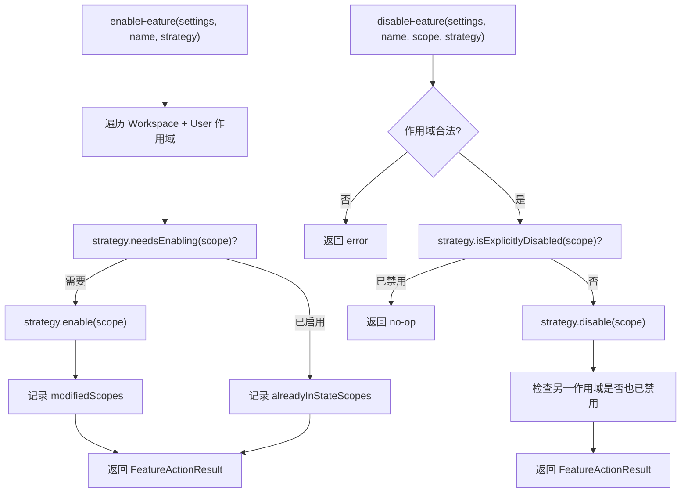

# featureToggleUtils.ts

> 提供通用的特性开关启用/禁用框架，通过策略模式支持不同特性类型（Agent、Skill 等）的开关逻辑。

## 概述

`featureToggleUtils.ts` 定义了一个通用的特性开关（Feature Toggle）框架。它通过**策略模式**（`FeatureToggleStrategy` 接口）将"判断是否需要启用"、"执行启用"、"判断是否已禁用"、"执行禁用"等操作抽象为可替换的策略方法，从而支持不同特性类型（如 Agent 白名单模式、Skill 黑名单模式）的统一处理。

框架提供两个核心函数 `enableFeature` 和 `disableFeature`，它们遍历可写作用域（User 和 Workspace），调用策略方法执行操作，并返回详细的操作结果元数据。

## 架构图（mermaid）

## 主要导出

| 导出名称 | 类型 | 描述 |
|---------|------|------|
| `ModifiedScope` | 接口 | 被修改的作用域信息：`{ scope: SettingScope, path: string }` |
| `FeatureActionStatus` | 类型别名 | `'success'` / `'no-op'` / `'error'` |
| `FeatureActionResult` | 接口 | 操作结果元数据，包含状态、操作类型、修改的作用域、已处于目标状态的作用域等 |
| `FeatureToggleStrategy` | 接口 | 策略模式接口，定义 `needsEnabling`、`enable`、`isExplicitlyDisabled`、`disable` 四个方法 |
| `enableFeature(settings, featureName, strategy)` | 函数 | 在所有可写作用域中启用特性 |
| `disableFeature(settings, featureName, scope, strategy)` | 函数 | 在指定作用域中禁用特性 |

## 核心逻辑

### enableFeature

1. 遍历 `[Workspace, User]` 两个可写作用域
2. 对每个作用域调用 `strategy.needsEnabling` 判断是否需要启用
3. 需要启用的调用 `strategy.enable` 执行启用
4. 如果所有作用域均已启用，返回 `no-op` 状态
5. 返回 `FeatureActionResult`，包含修改了哪些作用域和哪些已是目标状态

### disableFeature

1. 验证作用域合法性（必须是可加载作用域）
2. 调用 `strategy.isExplicitlyDisabled` 检查是否已禁用，是则返回 `no-op`
3. 调用 `strategy.disable` 执行禁用
4. 额外检查另一个可写作用域是否已经是禁用状态，记录到 `alreadyInStateScopes`

### 策略模式适配

| 特性类型 | needsEnabling | enable | isExplicitlyDisabled | disable |
|---------|---------------|--------|---------------------|---------|
| Agent（白名单） | `enabled !== true` | 设置 `enabled = true` | `enabled === false` | 设置 `enabled = false` |
| Skill（黑名单） | 在 disabled 列表中 | 从列表移除 | 在 disabled 列表中 | 加入列表 |

## 内部依赖

| 模块 | 用途 |
|------|------|
| `../config/settings.js` | `SettingScope`、`isLoadableSettingScope`、`LoadableSettingScope`、`LoadedSettings` |

## 外部依赖

无。
