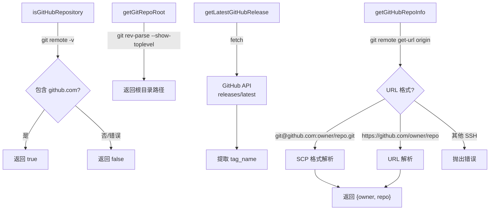

# gitUtils.ts

> 提供 Git 和 GitHub 相关的实用函数：仓库检测、根目录获取、最新发布查询和仓库信息解析。

## 概述

`gitUtils.ts` 封装了一组与 Git 和 GitHub 交互的工具函数。它通过执行 `git` 命令行工具来检测当前目录是否为 GitHub 仓库、获取 Git 仓库根目录、以及解析远程 URL 中的 owner/repo 信息。此外还提供了通过 GitHub REST API 查询最新 release 版本的异步函数，支持代理配置和超时控制。

## 架构图（mermaid）

## 主要导出

| 导出名称 | 类型 | 描述 |
|---------|------|------|
| `isGitHubRepository()` | 函数 | 检查当前目录是否在 GitHub 仓库中（通过 remote URL 匹配 `github.com`） |
| `getGitRepoRoot()` | 函数 | 获取 Git 仓库根目录的绝对路径 |
| `getLatestGitHubRelease(proxy?)` | 异步函数 | 从 GitHub API 获取 `run-gemini-cli` 项目的最新 release tag |
| `getGitHubRepoInfo()` | 函数 | 解析 origin 远程 URL，返回 `{ owner, repo }` |

## 核心逻辑

### isGitHubRepository

执行 `git remote -v`，用正则检查输出中是否包含 `github.com`。任何错误均静默返回 `false`。

### getGitRepoRoot

执行 `git rev-parse --show-toplevel`，返回去除空白的结果。如果结果为空则抛出错误。

### getLatestGitHubRelease

- 调用 `https://api.github.com/repos/google-github-actions/run-gemini-cli/releases/latest`
- 支持通过 `ProxyAgent`（undici）配置代理
- 使用 `AbortSignal.any` 组合 30 秒超时信号
- 返回 `tag_name` 字段的值

### getGitHubRepoInfo

支持两种 Git 远程 URL 格式：
1. **SCP 格式**（`git@github.com:owner/repo.git`）：替换前缀后按路径解析
2. **HTTPS 格式**（`https://github.com/owner/repo`）：使用 `new URL()` 解析
3. 非 GitHub 主机或格式异常时抛出错误
4. `.git` 后缀会被自动去除

## 内部依赖

| 模块 | 用途 |
|------|------|
| `@google/gemini-cli-core` | `debugLogger` 调试日志 |

## 外部依赖

| 模块 | 用途 |
|------|------|
| `node:child_process` | `execSync` 执行 Git 命令 |
| `undici` | `ProxyAgent` HTTP 代理支持 |
