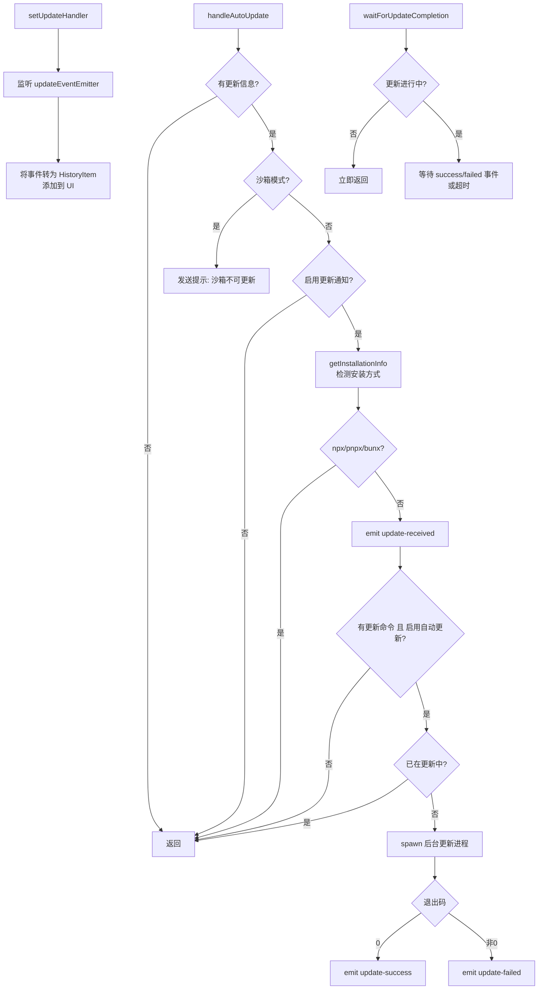

# handleAutoUpdate.ts

> 处理 CLI 的自动更新逻辑，包括版本检查、后台更新进程管理和 UI 更新通知。

## 概述

`handleAutoUpdate.ts` 实现了 CLI 的自动更新机制。当检测到新版本时，根据用户设置和安装方式决定是否执行自动更新：在后台启动更新进程（使用对应包管理器的更新命令），并通过事件发射器向 UI 层通知更新状态（接收到更新、更新成功、更新失败）。

模块还提供了等待后台更新完成的机制（`waitForUpdateCompletion`），以及 UI 层的更新事件处理器注册（`setUpdateHandler`），将更新事件转化为界面上的提示消息。

## 架构图（mermaid）

## 主要导出

| 导出名称 | 类型 | 描述 |
|---------|------|------|
| `_setUpdateStateForTesting(value)` | 函数 | 设置更新状态标志（仅测试用） |
| `isUpdateInProgress()` | 函数 | 检查是否有后台更新正在进行 |
| `waitForUpdateCompletion(timeoutMs?)` | 异步函数 | 等待后台更新完成或超时（默认 30 秒） |
| `handleAutoUpdate(info, settings, projectRoot, spawnFn?)` | 函数 | 处理自动更新的主逻辑 |
| `setUpdateHandler(addItem, setUpdateInfo)` | 函数 | 注册 UI 层的更新事件处理器，返回取消注册函数 |

## 核心逻辑

### handleAutoUpdate

1. **前置检查**：无更新信息/沙箱模式/通知禁用 -> 直接返回
2. **安装方式检测**：通过 `getInstallationInfo` 判断安装方式。npx/pnpx/bunx 方式跳过更新
3. **通知**：发射 `update-received` 事件（合并安装信息的提示）
4. **自动更新**：若有更新命令且用户启用了自动更新：
   - 构建更新命令，支持 nightly 版本标签替换
   - 使用 `spawnFn` 在后台启动更新进程（`detached: true`, `stdio: 'ignore'`）
   - `unref()` 子进程使父进程可独立退出
   - 监听 `close` 和 `error` 事件发射对应状态

### waitForUpdateCompletion

使用 `updateEventEmitter` 的 `once` 监听 `update-success` 和 `update-failed` 事件，配合 `setTimeout` 实现超时保护。内部有双重检查机制防止竞态条件。

### setUpdateHandler

注册四个事件监听器：
- `update-received`：设置更新信息，60 秒后若未成功安装则作为 INFO 消息显示
- `update-success`：显示成功消息
- `update-failed`：显示失败消息
- `update-info`：显示通用信息

返回清理函数用于取消所有注册。

## 内部依赖

| 模块 | 用途 |
|------|------|
| `../ui/utils/updateCheck.js` | `UpdateObject` 类型 |
| `../config/settings.js` | `LoadedSettings` 类型 |
| `./installationInfo.js` | `getInstallationInfo`、`PackageManager` 枚举 |
| `./updateEventEmitter.js` | `updateEventEmitter` 事件总线 |
| `../ui/types.js` | `MessageType`、`HistoryItem` 类型 |
| `./spawnWrapper.js` | `spawnWrapper` 默认 spawn 实现 |
| `@google/gemini-cli-core` | `debugLogger` |

## 外部依赖

| 模块 | 用途 |
|------|------|
| `node:child_process` | `spawn` 类型（通过参数注入） |
