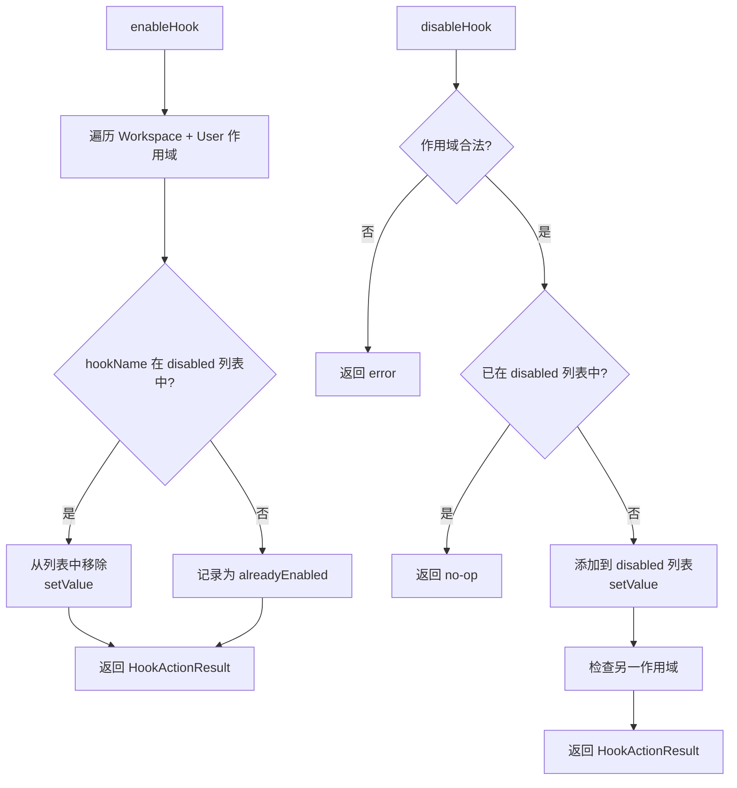

# hookSettings.ts

> 管理 Hook（钩子）的启用/禁用设置，通过操作 `hooksConfig.disabled` 黑名单列表实现。

## 概述

`hookSettings.ts` 提供了 Hook 配置的启用和禁用操作。与 Agent 的白名单模式不同，Hook 采用**黑名单模式**——默认启用，通过将名称加入 `hooksConfig.disabled` 数组来禁用。启用操作即从该数组中移除对应名称，禁用操作即添加名称到数组。

操作在 User 和 Workspace 两个可写作用域上进行，返回详细的操作结果元数据（成功/无操作/错误、修改了哪些作用域等）。

## 架构图（mermaid）

## 主要导出

| 导出名称 | 类型 | 描述 |
|---------|------|------|
| `HookActionStatus` | 类型别名 | `'success'` / `'no-op'` / `'error'` |
| `HookActionResult` | 接口 | Hook 操作结果元数据，包含 `hookName`、`action`、`status`、`modifiedScopes`、`alreadyInStateScopes`、`error` |
| `enableHook(settings, hookName)` | 函数 | 从所有可写作用域的禁用列表中移除指定 Hook |
| `disableHook(settings, hookName, scope)` | 函数 | 将指定 Hook 添加到指定作用域的禁用列表 |

## 核心逻辑

### enableHook

1. 遍历 `[Workspace, User]` 两个可写作用域
2. 检查每个作用域的 `hooksConfig.disabled` 数组是否包含目标 Hook 名称
3. 包含则从数组中过滤移除，通过 `settings.setValue` 写回
4. 所有作用域均不包含则返回 `no-op`
5. 写入操作用 try-catch 包裹，失败返回 `error` 状态

### disableHook

1. 验证作用域合法性
2. 检查目标作用域的 `hooksConfig.disabled` 是否已包含该 Hook
3. 已包含则返回 `no-op`
4. 不包含则追加到数组并写回
5. 额外检查另一可写作用域是否也已禁用，记录到 `alreadyInStateScopes`

## 内部依赖

| 模块 | 用途 |
|------|------|
| `../config/settings.js` | `SettingScope`、`isLoadableSettingScope`、`LoadedSettings` |
| `@google/gemini-cli-core` | `getErrorMessage` 提取错误消息 |
| `./skillSettings.js` | `ModifiedScope` 类型（复用） |

## 外部依赖

无。
