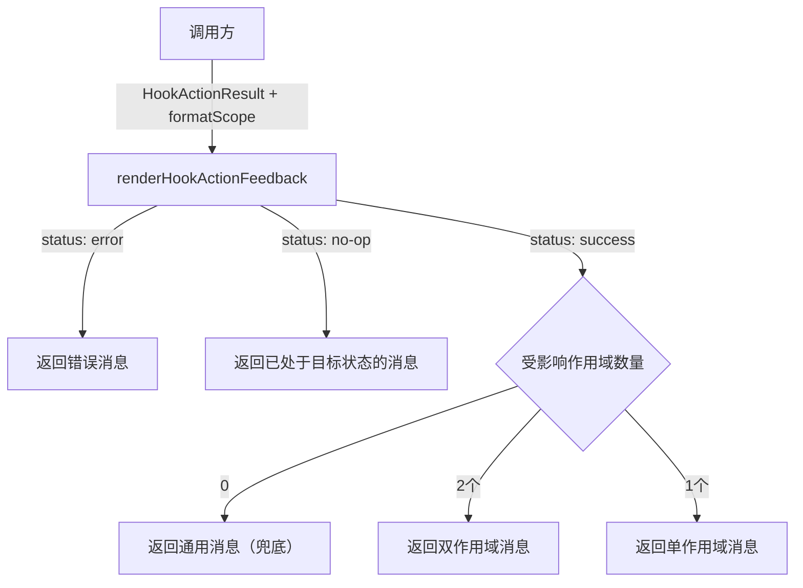

# hookUtils.ts

> 构建 Hook 操作结果的用户反馈消息，支持自定义作用域标签的渲染格式。

## 概述

`hookUtils.ts` 提供了一个纯函数 `renderHookActionFeedback`，用于根据 Hook 启用/禁用操作的结果（`HookActionResult`）生成面向用户的反馈消息。其设计与 `agentUtils.ts` 对称，通过 `formatScope` 回调函数将消息构建与 UI 渲染逻辑分离。

与 Agent 的反馈消息不同，Hook 的描述使用"从禁用列表中移除/添加到禁用列表"的措辞，反映其黑名单机制。

## 架构图（mermaid）

## 主要导出

| 导出名称 | 类型 | 描述 |
|---------|------|------|
| `renderHookActionFeedback(result, formatScope)` | 函数 | 根据操作结果和格式化回调构建反馈消息字符串 |

## 核心逻辑

1. **错误处理**：若 `status === 'error'`，返回错误消息或默认提示。
2. **无操作**：若 `status === 'no-op'`，返回"Hook 已处于目标状态"的消息。
3. **成功**：合并 `modifiedScopes` 和 `alreadyInStateScopes`：
   - 0 个作用域（兜底）：返回通用消息 `Hook "{name}" enabled/disabled.`
   - 2 个作用域：启用用 "and" 连接，禁用描述为 "is now disabled in both"
   - 1 个作用域：直接拼接
4. 作用域标签映射：`Workspace` 显示为 `"workspace"`（与 Agent 的 `"project"` 不同），其他作用域转为小写。
5. 描述措辞：启用为 "by removing it from the disabled list in"，禁用为 "by adding it to the disabled list in"。

## 内部依赖

| 模块 | 用途 |
|------|------|
| `../config/settings.js` | `SettingScope` 枚举用于作用域标签映射 |
| `./hookSettings.js` | `HookActionResult` 类型定义 |

## 外部依赖

无。
