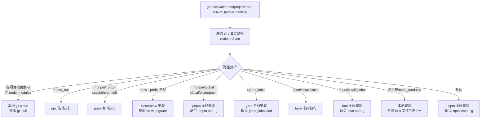

# installationInfo.ts

> 检测 CLI 的安装方式和包管理器类型，生成对应的更新命令和提示信息。

## 概述

`installationInfo.ts` 通过分析 CLI 可执行文件的真实路径（`process.argv[1]` 经 `fs.realpathSync` 解析）来判断安装方式：npm 全局安装、yarn 全局安装、pnpm 全局安装、Homebrew 安装、npx/pnpx/bunx 临时执行、本地 node_modules 安装、或 git clone 开发模式等。根据检测结果返回对应的包管理器类型、更新命令和用户提示消息。

这些信息主要供自动更新模块（`handleAutoUpdate.ts`）使用，以决定是否执行自动更新以及使用何种更新命令。

## 架构图（mermaid）

## 主要导出

| 导出名称 | 类型 | 描述 |
|---------|------|------|
| `isDevelopment` | 常量 | 是否为开发环境（`NODE_ENV === 'development'`） |
| `PackageManager` | 枚举 | 包管理器类型：`NPM` / `YARN` / `PNPM` / `PNPX` / `BUN` / `BUNX` / `HOMEBREW` / `NPX` / `UNKNOWN` |
| `InstallationInfo` | 接口 | 安装信息：`packageManager`、`isGlobal`、`updateCommand?`、`updateMessage?` |
| `getInstallationInfo(projectRoot, isAutoUpdateEnabled)` | 函数 | 检测安装方式，返回安装信息 |

## 核心逻辑

### 检测优先级

路径匹配按以下顺序依次检查（先匹配先返回）：

1. **本地 git clone**：真实路径在项目根目录内且不在 `node_modules` 中，当前目录是 git 仓库
2. **npx**：路径包含 `/.npm/_npx` 或 `/npm/_npx`
3. **pnpx**：路径包含 `/.pnpm/_pnpx` 或 `/.cache/pnpm/dlx`
4. **Homebrew**（仅 macOS）：执行 `brew --prefix gemini-cli` 后比较真实路径
5. **pnpm 全局**：路径包含 `/.pnpm/global` 或 `/.local/share/pnpm`
6. **yarn 全局**：路径包含 `/.yarn/global`
7. **bunx 临时**：路径包含 `/.bun/install/cache`
8. **bun 全局**：路径包含 `/.bun/install/global`
9. **本地 node_modules**：路径以 `{projectRoot}/node_modules` 开头，通过 lock 文件推断包管理器
10. **默认 npm 全局**：其他情况一律假定为 npm 全局安装

### 更新命令

- 临时执行方式（npx/pnpx/bunx）和本地安装不提供更新命令
- Homebrew 仅提供手动更新提示
- 全局安装方式根据 `isAutoUpdateEnabled` 切换消息：启用自动更新时提示"正在自动更新"，未启用时提示手动命令

## 内部依赖

| 模块 | 用途 |
|------|------|
| `@google/gemini-cli-core` | `debugLogger`（错误日志）、`isGitRepository`（Git 仓库检测） |

## 外部依赖

| 模块 | 用途 |
|------|------|
| `node:fs` | `realpathSync`、`existsSync`（路径解析和 lock 文件检测） |
| `node:path` | `join`（路径拼接） |
| `node:child_process` | `execSync`（执行 `brew --prefix`） |
| `node:process` | `process.argv`、`process.env`、`process.platform`、`process.cwd` |
