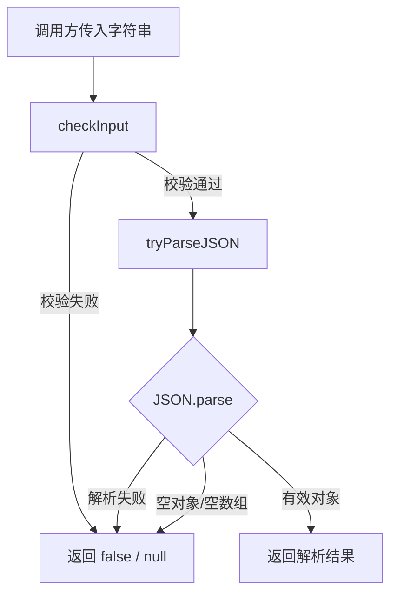

# jsonoutput.ts

> 安全地校验和解析 JSON 字符串输入的工具模块

## 概述

`jsonoutput.ts` 提供了两个用于处理 JSON 输入的实用函数。`checkInput` 对输入字符串进行预校验（非空、以 `{` 或 `[` 开头、不含 ANSI 转义序列），`tryParseJSON` 在此基础上尝试解析 JSON 并过滤掉空对象和空数组，返回有效的对象或 `null`。

## 架构图（mermaid）

## 主要导出

| 导出名 | 类型 | 说明 |
|--------|------|------|
| `checkInput` | `(input: string \| null \| undefined) => boolean` | 校验输入是否为可尝试解析的 JSON 字符串 |
| `tryParseJSON` | `(input: string) => object \| null` | 安全解析 JSON，失败或为空值时返回 `null` |

## 核心逻辑

1. **checkInput** - 依次检查：非 null/undefined、trim 后非空、以 `{` 或 `[` 开头、经 `stripAnsi` 处理后与原文一致（排除含 ANSI 转义码的输入）。
2. **tryParseJSON** - 先调用 `checkInput` 预过滤，再用 `JSON.parse` 解析；解析成功后额外过滤 `null`、非对象类型、空数组和空对象。

## 内部依赖

无。

## 外部依赖

| 包名 | 用途 |
|------|------|
| `strip-ansi` | 移除字符串中的 ANSI 转义序列，防止含控制字符的输入被误解析 |
