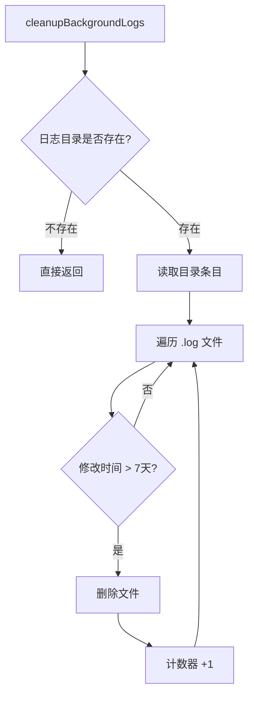

# logCleanup.ts

> 自动清理超过 7 天的后台进程日志文件

## 概述

`logCleanup.ts` 提供了一个异步函数 `cleanupBackgroundLogs`，用于扫描 `~/.gemini/tmp/background-processes/` 目录下的 `.log` 文件，删除修改时间超过 7 天的日志。该函数采用"尽力而为"策略，任何错误都不会中断 CLI 主流程。

## 架构图（mermaid）

## 主要导出

| 导出名 | 类型 | 说明 |
|--------|------|------|
| `cleanupBackgroundLogs` | `(debugMode?: boolean) => Promise<void>` | 清理过期的后台进程日志文件 |

## 核心逻辑

1. 通过 `ShellExecutionService.getLogDir()` 获取日志目录路径。
2. 检查目录是否存在，不存在则直接返回。
3. 遍历目录下所有 `.log` 文件，比较文件修改时间与当前时间的差值。
4. 差值超过 `RETENTION_PERIOD_MS`（7 天 = 604800000 毫秒）的文件被删除。
5. 当 `debugMode` 为 `true` 时，输出调试信息。

## 内部依赖

无。

## 外部依赖

| 包名 | 用途 |
|------|------|
| `node:fs` (promises) | 文件系统异步操作（access、readdir、stat、unlink） |
| `node:path` | 路径拼接 |
| `@google/gemini-cli-core` | `ShellExecutionService.getLogDir()` 获取日志目录；`debugLogger` 调试日志输出 |
