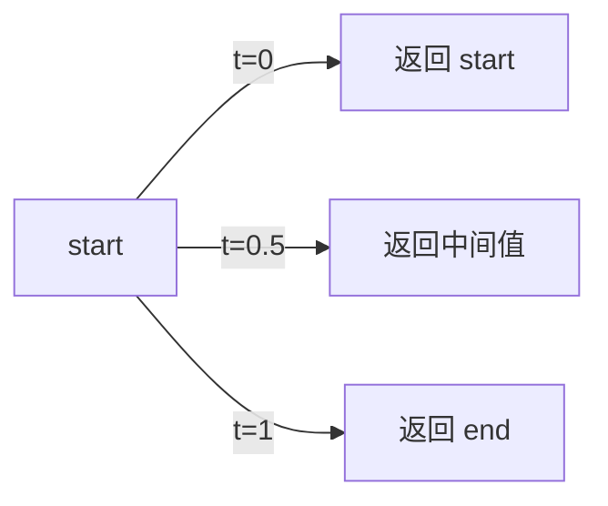

# math.ts

> 提供线性插值（lerp）数学工具函数

## 概述

`math.ts` 是一个极简的数学工具模块，仅导出一个 `lerp`（线性插值）函数，用于在两个数值之间按给定比例进行插值计算，常用于动画和 UI 渐变等场景。

## 架构图（mermaid）

## 主要导出

| 导出名 | 类型 | 说明 |
|--------|------|------|
| `lerp` | `(start: number, end: number, t: number) => number` | 线性插值，`t` 通常在 0-1 之间 |

## 核心逻辑

公式：`start + (end - start) * t`

- 当 `t = 0` 时返回 `start`
- 当 `t = 1` 时返回 `end`
- 当 `t` 在 0-1 之间时返回两者之间的线性插值

## 内部依赖

无。

## 外部依赖

无。
