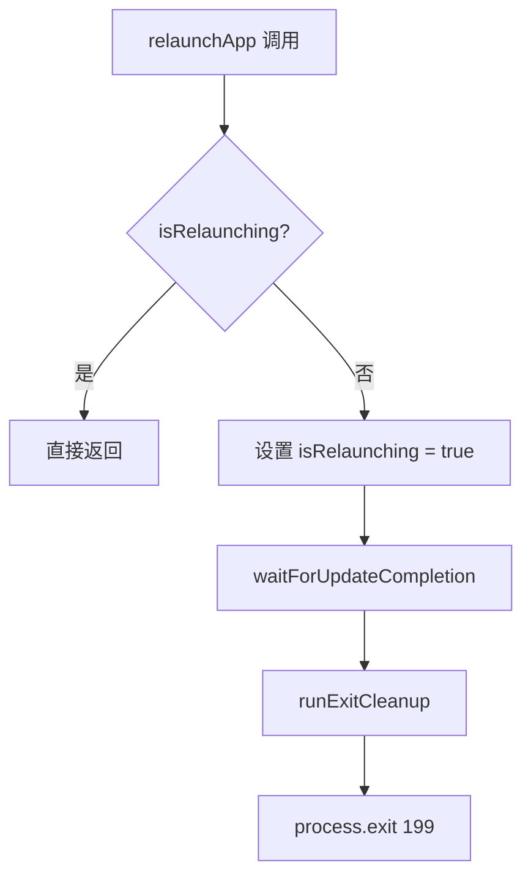

# processUtils.ts

> 管理 CLI 进程退出与重启信号的工具模块

## 概述

`processUtils.ts` 定义了用于 CLI 进程生命周期管理的常量和函数。核心功能是通过特殊退出码（199）向父进程发出"需要重新启动"的信号，并提供 `relaunchApp` 函数来安全地完成更新等待、清理和重启流程。内部使用 `isRelaunching` 标志确保重启操作不会重复执行。

## 架构图（mermaid）

## 主要导出

| 导出名 | 类型 | 说明 |
|--------|------|------|
| `RELAUNCH_EXIT_CODE` | `number` (199) | 特殊退出码，表示 CLI 需要被重新启动 |
| `relaunchApp` | `() => Promise<void>` | 等待更新完成、执行清理后以 199 退出进程 |
| `_resetRelaunchStateForTesting` | `() => void` | 仅用于测试，重置内部重启状态标志 |

## 核心逻辑

1. `relaunchApp` 被调用时先检查 `isRelaunching` 防止重复调用。
2. 等待 `waitForUpdateCompletion()` 确保自动更新流程完成。
3. 执行 `runExitCleanup()` 进行退出前的资源清理。
4. 调用 `process.exit(199)` 以特殊退出码退出，父进程据此决定是否重启。

## 内部依赖

| 模块 | 用途 |
|------|------|
| `./cleanup.js` | `runExitCleanup` - 退出前清理 |
| `./handleAutoUpdate.js` | `waitForUpdateCompletion` - 等待自动更新完成 |

## 外部依赖

无。
