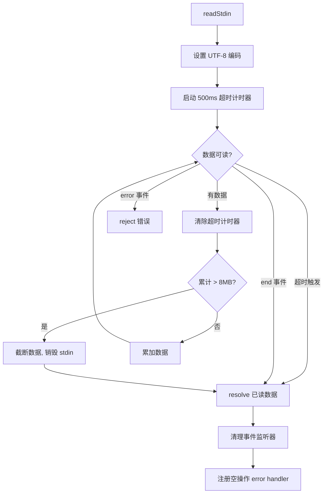

# readStdin.ts

> 从标准输入异步读取管道数据，支持大小限制与超时保护

## 概述

`readStdin.ts` 提供了 `readStdin` 函数，用于从 `process.stdin` 异步读取管道输入数据。它实现了三重保护机制：8MB 大小上限防止内存溢出、500ms 超时防止在无管道输入的终端中无限阻塞、以及优雅的错误处理和事件监听器清理以避免进程崩溃。

## 架构图（mermaid）

## 主要导出

| 导出名 | 类型 | 说明 |
|--------|------|------|
| `readStdin` | `() => Promise<string>` | 异步读取 stdin 管道数据并返回字符串 |

## 核心逻辑

1. **大小限制** - `MAX_STDIN_SIZE` 为 8MB，超出后截断数据并销毁 stdin 流。
2. **超时保护** - 500ms 内无数据则认为无管道输入，直接 resolve 空字符串。首次收到数据时清除超时计时器。
3. **事件监听器清理** - 在 `onEnd`/`onError` 时统一通过 `cleanup` 移除所有监听器。
4. **防崩溃处理** - 清理后若 stdin 无 error 监听器，注册一个空操作 `noopErrorHandler` 防止后续 EIO 等错误导致进程崩溃。

## 内部依赖

无。

## 外部依赖

| 包名 | 用途 |
|------|------|
| `@google/gemini-cli-core` | `debugLogger` - 超出大小限制时输出警告日志 |
