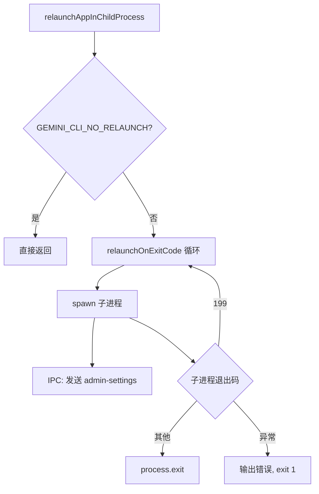

# relaunch.ts

> 在子进程中运行 CLI 并支持基于退出码的自动重启

## 概述

`relaunch.ts` 实现了 CLI 的"子进程重启"机制。`relaunchAppInChildProcess` 将 CLI 以子进程方式运行，并通过 IPC 通道与父进程通信。`relaunchOnExitCode` 实现了无限循环：当子进程退出码为 199（重启信号）时自动重新生成子进程；其他退出码则直接终止父进程。该机制用于支持 CLI 自动更新后无缝重启。

## 架构图（mermaid）

## 主要导出

| 导出名 | 类型 | 说明 |
|--------|------|------|
| `relaunchOnExitCode` | `(runner: () => Promise<number>) => Promise<never>` | 循环执行 runner，退出码为 199 时重启 |
| `relaunchAppInChildProcess` | `(additionalNodeArgs, additionalScriptArgs, remoteAdminSettings?) => Promise<void>` | 以子进程方式运行 CLI，支持自动重启 |

## 核心逻辑

1. **环境变量防护** - 子进程环境中设置 `GEMINI_CLI_NO_RELAUNCH=true` 防止递归重启。
2. **IPC 通信** - 使用 `stdio: ['inherit', 'inherit', 'inherit', 'ipc']` 建立 IPC 通道，父进程将管理员设置发送给子进程，子进程通过 `admin-settings-update` 消息回传更新。
3. **stdin 管理** - 子进程运行时父进程暂停 stdin，子进程退出后恢复。
4. **错误处理** - 捕获 spawn 异常，输出到 stderr 后以退出码 1 终止。

## 内部依赖

| 模块 | 用途 |
|------|------|
| `./processUtils.js` | `RELAUNCH_EXIT_CODE` 常量 (199) |

## 外部依赖

| 包名 | 用途 |
|------|------|
| `node:child_process` | `spawn` - 创建子进程 |
| `@google/gemini-cli-core` | `writeToStderr` - 错误输出；`AdminControlsSettings` 类型 |
