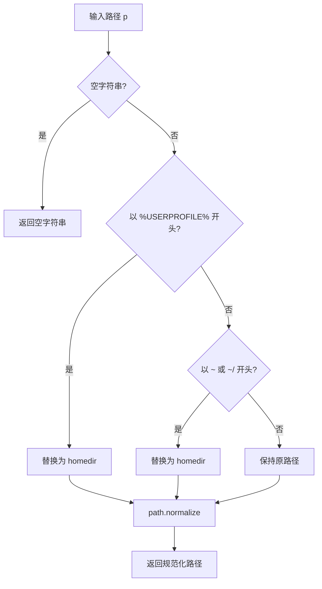

# resolvePath.ts

> 解析包含 `~` 或 `%USERPROFILE%` 的路径为绝对路径

## 概述

`resolvePath.ts` 提供了一个路径解析函数，能够将用户输入中的 `~`（Unix 风格）和 `%USERPROFILE%`（Windows 风格）前缀展开为实际的用户主目录路径，并通过 `path.normalize` 进行规范化处理。

## 架构图（mermaid）

## 主要导出

| 导出名 | 类型 | 说明 |
|--------|------|------|
| `resolvePath` | `(p: string) => string` | 展开 `~` / `%USERPROFILE%` 并规范化路径 |

## 核心逻辑

1. 空字符串直接返回空字符串。
2. 以 `%userprofile%` 开头（不区分大小写）时替换为 `homedir()`。
3. 等于 `~` 或以 `~/` 开头时替换为 `homedir()`。
4. 最后使用 `path.normalize` 处理多余的分隔符和 `.`/`..`。

## 内部依赖

无。

## 外部依赖

| 包名 | 用途 |
|------|------|
| `node:path` | `normalize` - 路径规范化 |
| `@google/gemini-cli-core` | `homedir` - 获取用户主目录 |
