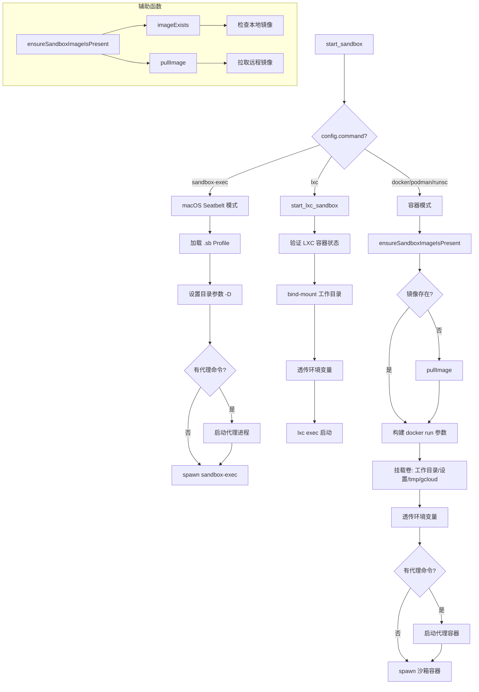

# sandbox.ts

> CLI 沙箱环境的启动与管理，支持 Docker/Podman、macOS Seatbelt 和 LXC 三种隔离方案

## 概述

`sandbox.ts` 是 Gemini CLI 沙箱功能的核心实现，约 1191 行。它通过 `start_sandbox` 函数根据配置的沙箱类型启动隔离环境。支持三种沙箱后端：

1. **macOS Seatbelt (`sandbox-exec`)** - 使用 macOS 原生的沙箱机制，通过 `.sb` 配置文件控制权限。
2. **Docker/Podman（含 `runsc` gVisor 运行时）** - 使用容器镜像运行隔离环境，支持自定义镜像、端口映射、卷挂载、代理配置等。
3. **LXC/LXD** - 使用预创建的 LXC 容器，通过设备挂载和 `lxc exec` 执行命令。

模块还处理了镜像检测与自动拉取、环境变量透传、网络隔离与代理、UID/GID 映射等复杂场景。

## 架构图（mermaid）

## 主要导出

| 导出名 | 类型 | 说明 |
|--------|------|------|
| `start_sandbox` | `(config: SandboxConfig, nodeArgs?: string[], cliConfig?: Config, cliArgs?: string[]) => Promise<number>` | 根据配置启动对应类型的沙箱环境，返回退出码 |

## 核心逻辑

### macOS Seatbelt 模式
- 加载内置或自定义的 `.sb` 沙箱配置文件。
- 通过 `-D` 参数传递 TARGET_DIR、TMP_DIR、HOME_DIR、CACHE_DIR 及最多 5 个 INCLUDE_DIR。
- 支持通过 `GEMINI_SANDBOX_PROXY_COMMAND` 启动本地代理进程。
- 以 `sandbox-exec` 命令 spawn 子进程。

### Docker/Podman 容器模式
- **镜像管理** - `ensureSandboxImageIsPresent` 先检查本地镜像，不存在则自动拉取。`BUILD_SANDBOX` 环境变量支持从源码构建镜像。
- **卷挂载** - 自动挂载工作目录、用户设置目录、tmpdir、homedir、gcloud 配置、ADC 凭证、VIRTUAL_ENV 等。支持 `SANDBOX_MOUNTS` 自定义挂载。
- **环境变量透传** - 透传 API 密钥、模型配置、终端设置、IDE 模式变量等。
- **网络与代理** - 无网络访问或有代理时创建隔离 Docker 网络；代理在独立容器中运行并连接到沙箱网络。
- **UID/GID 映射** - 在 Debian/Ubuntu 系统上自动以 root 启动容器，在容器内创建匹配宿主 UID/GID 的用户后降权执行。
- **容器命名** - 使用镜像名+递增索引或随机后缀避免冲突。

### LXC 模式
- 通过 `lxc list` 验证容器存在且正在运行。
- 使用 `lxc config device add` 将工作目录和允许路径 bind-mount 到容器中。
- 通过 `lxc exec` 在容器内执行命令，退出时自动清理挂载设备。

## 内部依赖

| 模块 | 用途 |
|------|------|
| `./sandboxUtils.js` | `getContainerPath`、`shouldUseCurrentUserInSandbox`、`parseImageName`、`ports`、`entrypoint` 等沙箱工具函数和常量 |
| `../ui/utils/ConsolePatcher.js` | `ConsolePatcher` - 沙箱运行期间修补控制台输出 |

## 外部依赖

| 包名 | 用途 |
|------|------|
| `node:child_process` | `exec`、`execFile`、`execSync`、`spawn`、`spawnSync` - 进程管理 |
| `node:path` | 路径操作 |
| `node:fs` | 文件系统同步操作（existsSync、mkdirSync 等） |
| `node:os` | 获取平台信息和临时目录 |
| `node:url` | `fileURLToPath` - 获取 seatbelt profile 文件路径 |
| `node:util` | `promisify` - 将回调函数 Promise 化 |
| `node:crypto` | `randomBytes` - 生成容器名称随机后缀 |
| `shell-quote` | `quote`、`parse` - 安全处理 shell 命令参数 |
| `@google/gemini-cli-core` | `Config`、`SandboxConfig` 类型；`coreEvents`、`debugLogger`、`FatalSandboxError`、`GEMINI_DIR`、`homedir` |
