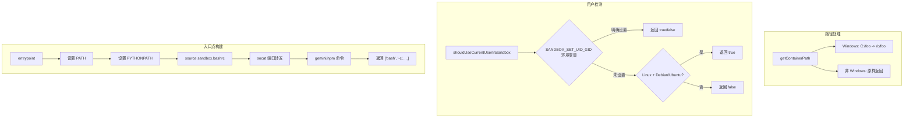

# sandboxUtils.ts

> 沙箱环境的通用工具函数与常量定义

## 概述

`sandboxUtils.ts` 提供了沙箱模块所需的辅助功能，包括：路径转换（Windows 路径到容器路径）、判断是否需要使用当前用户 UID/GID、镜像名称解析、端口配置读取、以及容器入口点命令构建。这些函数被 `sandbox.ts` 主模块广泛使用。

## 架构图（mermaid）

## 主要导出

| 导出名 | 类型 | 说明 |
|--------|------|------|
| `LOCAL_DEV_SANDBOX_IMAGE_NAME` | `string` | 本地开发沙箱镜像名称 `'gemini-cli-sandbox'` |
| `SANDBOX_NETWORK_NAME` | `string` | 沙箱 Docker 网络名称 |
| `SANDBOX_PROXY_NAME` | `string` | 沙箱代理容器名称 |
| `BUILTIN_SEATBELT_PROFILES` | `string[]` | 内置的 macOS Seatbelt 配置文件名列表 |
| `getContainerPath` | `(hostPath: string) => string` | 将宿主机路径转换为容器内路径（主要处理 Windows 盘符） |
| `shouldUseCurrentUserInSandbox` | `() => Promise<boolean>` | 判断是否应在沙箱中使用当前用户 UID/GID |
| `parseImageName` | `(image: string) => string` | 从完整镜像名中提取短名称和标签 |
| `ports` | `() => string[]` | 从 `SANDBOX_PORTS` 环境变量解析端口列表 |
| `entrypoint` | `(workdir: string, cliArgs: string[]) => string[]` | 构建容器入口点命令数组 |

## 核心逻辑

1. **getContainerPath** - 在 Windows 上将 `C:\foo\bar` 转换为 `/c/foo/bar`；非 Windows 原样返回。
2. **shouldUseCurrentUserInSandbox** - 优先检查 `SANDBOX_SET_UID_GID` 环境变量；未设置时在 Linux 上读取 `/etc/os-release` 检测 Debian/Ubuntu 系发行版。
3. **entrypoint** - 构建完整的容器启动命令，包括：将工作目录下的 PATH/PYTHONPATH 路径追加到环境变量、加载自定义 `sandbox.bashrc`、为每个端口设置 `socat` 转发、拼接 gemini CLI 命令。

## 内部依赖

无。

## 外部依赖

| 包名 | 用途 |
|------|------|
| `node:os` | 平台检测 |
| `node:fs` | 文件存在性检查（`existsSync`） |
| `node:fs/promises` | 读取 `/etc/os-release` |
| `shell-quote` | `quote` - 安全地引用 shell 参数 |
| `@google/gemini-cli-core` | `debugLogger` - 调试日志；`GEMINI_DIR` - 项目设置目录常量 |
