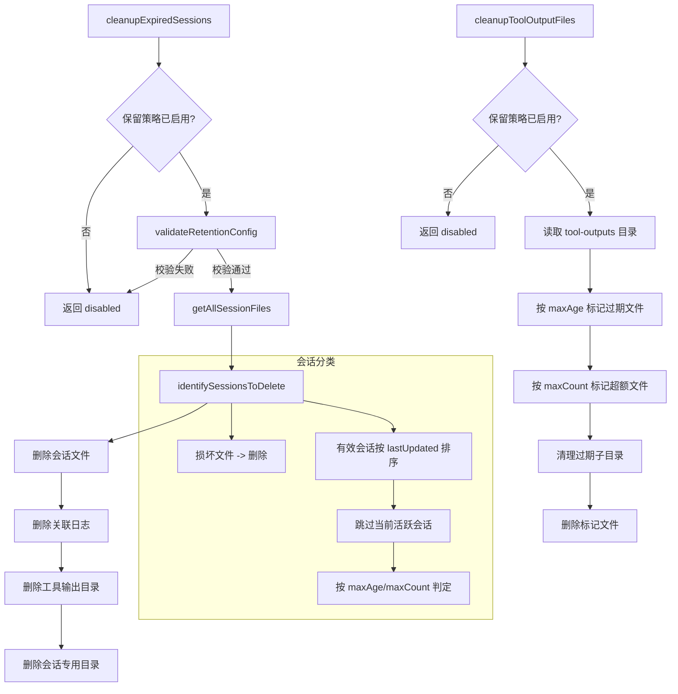

# sessionCleanup.ts

> 基于保留策略自动清理过期会话文件和工具输出文件

## 概述

`sessionCleanup.ts` 实现了 CLI 的会话生命周期管理，约 533 行。它提供两个主要功能：

1. **会话清理** (`cleanupExpiredSessions`) - 在 CLI 启动时根据用户配置的保留策略（最大保留时间 `maxAge` 和最大数量 `maxCount`）删除过期或损坏的会话文件，同时清理关联的活动日志、工具输出和会话目录。
2. **工具输出清理** (`cleanupToolOutputFiles`) - 独立清理 `tool-outputs` 目录下的过期文件和子目录。

两者均采用"尽力而为"策略，清理失败不会影响 CLI 正常启动。

## 架构图（mermaid）

## 主要导出

| 导出名 | 类型 | 说明 |
|--------|------|------|
| `DEFAULT_MIN_RETENTION` | `string` (`'1d'`) | 最小保留期限默认值 |
| `CleanupResult` | `interface` | 会话清理结果：disabled/scanned/deleted/skipped/failed |
| `ToolOutputCleanupResult` | `interface` | 工具输出清理结果：disabled/scanned/deleted/failed |
| `cleanupExpiredSessions` | `(config, settings) => Promise<CleanupResult>` | 根据保留策略清理过期会话及关联资源 |
| `identifySessionsToDelete` | `(allFiles, retentionConfig) => Promise<SessionFileEntry[]>` | 识别需要删除的会话（损坏文件 + 过期会话） |
| `cleanupToolOutputFiles` | `(settings, debugMode?, projectTempDir?) => Promise<ToolOutputCleanupResult>` | 清理过期的工具输出文件 |

## 核心逻辑

### 会话清理流程
1. 检查 `settings.general.sessionRetention.enabled` 是否启用。
2. `validateRetentionConfig` 校验配置：maxAge 格式、最小保留期限、maxCount 最小值。
3. `getAllSessionFiles` 加载所有会话文件（含损坏文件）。
4. `identifySessionsToDelete` 标记待删除会话：
   - 所有无法解析的损坏文件直接标记删除。
   - 有效会话按 `lastUpdated` 降序排列，跳过当前活跃会话。
   - 根据 `maxAge` 判定超时会话，根据 `maxCount` 判定超额会话。
5. 逐个删除会话文件及关联的日志文件（`session-{id}.jsonl`）、工具输出目录（`tool-outputs/session-{id}`）和会话专用目录。

### 工具输出清理流程
1. 获取 `tool-outputs` 目录下的所有文件和子目录。
2. 并行获取文件 stat 信息，按修改时间排序。
3. 按 `maxAge` 标记过期文件，按 `maxCount` 标记超额文件。
4. 遍历 `session-*` 子目录，按 `maxAge` 清理过期子目录。
5. 删除所有标记的文件。

### 保留期限解析
`parseRetentionPeriod` 支持的格式：`<数字><单位>`，单位为 `h`（小时）、`d`（天）、`w`（周）、`m`（月/30天）。值不能为 0。

## 内部依赖

| 模块 | 用途 |
|------|------|
| `./sessionUtils.js` | `getAllSessionFiles`、`SessionFileEntry` - 加载会话文件 |
| `../config/settings.js` | `Settings`、`SessionRetentionSettings` 类型 |

## 外部依赖

| 包名 | 用途 |
|------|------|
| `node:fs/promises` | 文件系统异步操作 |
| `node:path` | 路径拼接 |
| `@google/gemini-cli-core` | `debugLogger`、`sanitizeFilenamePart`、`Storage`、`TOOL_OUTPUTS_DIR`、`Config` |
