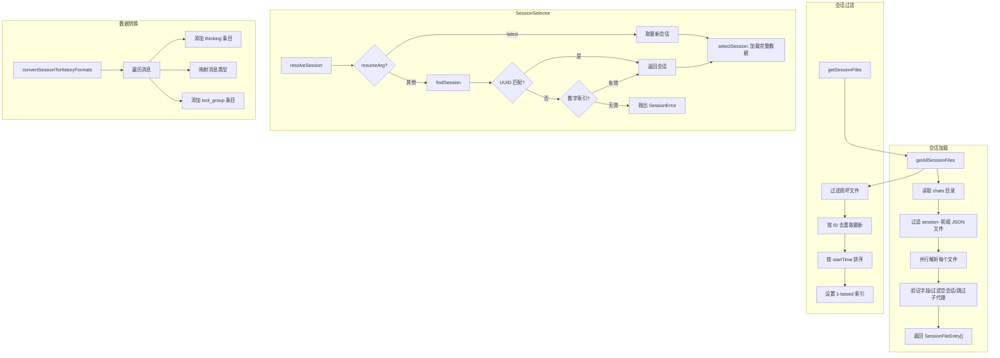

# sessionUtils.ts

> 会话发现、选择、格式化和数据转换的核心工具集

## 概述

`sessionUtils.ts` 是会话管理的基础设施模块，约 616 行。它定义了会话相关的核心类型（`SessionInfo`、`SessionError`、`TextMatch` 等），提供会话文件的加载与解析功能（`getSessionFiles`、`getAllSessionFiles`），封装了通过 UUID 或序号查找和恢复会话的逻辑（`SessionSelector` 类），以及将会话数据转换为 UI 历史格式的转换器（`convertSessionToHistoryFormats`）。

## 架构图（mermaid）

## 主要导出

| 导出名 | 类型 | 说明 |
|--------|------|------|
| `RESUME_LATEST` | `string` (`'latest'`) | 恢复最新会话的标识符 |
| `SessionErrorCode` | `type` | 会话错误码类型：`NO_SESSIONS_FOUND` / `INVALID_SESSION_IDENTIFIER` |
| `SessionError` | `class` | 会话错误类，含静态工厂方法 |
| `TextMatch` | `interface` | 文本搜索匹配结果，含前后上下文 |
| `SessionInfo` | `interface` | 会话元信息（ID、时间、消息数、显示名等） |
| `SessionFileEntry` | `interface` | 会话文件条目，损坏文件的 sessionInfo 为 null |
| `SessionSelectionResult` | `interface` | 会话选择结果（路径、数据、显示信息） |
| `hasUserOrAssistantMessage` | `(messages) => boolean` | 检查会话是否有用户或助手消息 |
| `cleanMessage` | `(message) => string` | 清洗消息文本用于显示 |
| `extractFirstUserMessage` | `(messages) => string` | 提取首条有意义的用户消息 |
| `formatRelativeTime` | `(timestamp, style?) => string` | 格式化为相对时间（"2 hours ago" 或 "2h"） |
| `getAllSessionFiles` | `(chatsDir, currentSessionId?, options?) => Promise<SessionFileEntry[]>` | 加载所有会话文件（含损坏） |
| `getSessionFiles` | `(chatsDir, currentSessionId?, options?) => Promise<SessionInfo[]>` | 加载有效会话并去重排序 |
| `SessionSelector` | `class` | 会话发现与选择工具类 |
| `convertSessionToHistoryFormats` | `(messages) => { uiHistory }` | 将会话消息转换为 UI 历史条目 |

## 核心逻辑

### 会话文件加载
1. `getAllSessionFiles` 读取 chats 目录，过滤 `session-*.json` 文件，并行解析每个文件。
2. 验证必须字段（sessionId、messages、startTime、lastUpdated），跳过无用户/助手消息的空会话和 `kind === 'subagent'` 的子代理会话。
3. `getSessionFiles` 在此基础上过滤损坏文件、按 sessionId 去重（保留最新）、按 startTime 排序并分配 1-based 索引。

### SessionSelector
- `listSessions` - 获取当前项目的会话列表。
- `findSession` - 先尝试 UUID 完整匹配，再尝试数字索引匹配。
- `resolveSession` - 处理 `latest`/UUID/索引三种恢复参数，返回完整的会话数据。

### 数据转换
`convertSessionToHistoryFormats` 遍历消息记录，按类型映射为 UI 组件所需的历史条目（thinking、user/gemini/info/error/warning 消息、tool_group）。

## 内部依赖

| 模块 | 用途 |
|------|------|
| `../ui/utils/textUtils.js` | `stripUnsafeCharacters` - 清除不安全字符用于显示名 |
| `../ui/types.js` | `MessageType`、`HistoryItemWithoutId` - UI 类型定义 |

## 外部依赖

| 包名 | 用途 |
|------|------|
| `node:fs/promises` | 文件读取和目录操作 |
| `node:path` | 路径拼接 |
| `@google/gemini-cli-core` | `checkExhaustive`、`partListUnionToString`、`SESSION_FILE_PREFIX`、`CoreToolCallStatus`、`Config`、`ConversationRecord`、`MessageRecord` |
