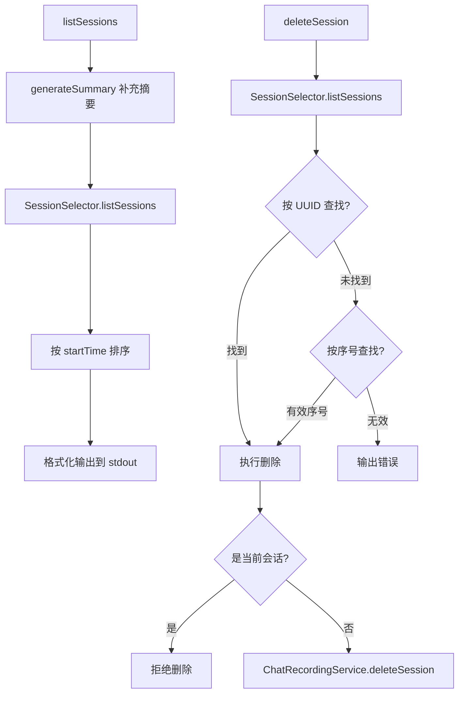

# sessions.ts

> 提供会话列表展示与会话删除的用户交互功能

## 概述

`sessions.ts` 是面向用户的会话管理模块，提供两个核心功能：`listSessions` 展示当前项目的所有可用会话列表（按时间排序，显示序号、标题、相对时间、当前会话标记和 ID），`deleteSession` 根据序号或 UUID 删除指定会话。两者均通过 `SessionSelector` 类与底层会话文件系统交互。

## 架构图（mermaid）

## 主要导出

| 导出名 | 类型 | 说明 |
|--------|------|------|
| `listSessions` | `(config: Config) => Promise<void>` | 列出当前项目所有会话并输出到标准输出 |
| `deleteSession` | `(config: Config, sessionIndex: string) => Promise<void>` | 根据序号或 UUID 删除指定会话 |

## 核心逻辑

1. **listSessions** - 先调用 `generateSummary` 确保最新会话有摘要，然后通过 `SessionSelector` 获取会话列表，按开始时间排序后逐条输出，包含序号、标题（最多 100 字符）、相对时间和会话 ID。
2. **deleteSession** - 支持两种标识方式：UUID 直接匹配或 1-based 数字序号。禁止删除当前活跃会话。使用 `ChatRecordingService.deleteSession` 执行实际删除。

## 内部依赖

| 模块 | 用途 |
|------|------|
| `./sessionUtils.js` | `formatRelativeTime`、`SessionSelector`、`SessionInfo` |

## 外部依赖

| 包名 | 用途 |
|------|------|
| `@google/gemini-cli-core` | `ChatRecordingService`、`generateSummary`、`writeToStderr`、`writeToStdout`、`Config` |
