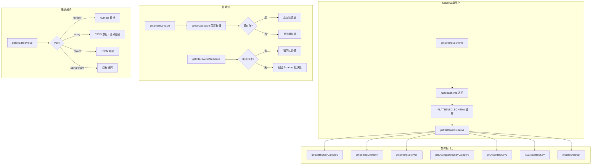

# settingsUtils.ts

> 设置 Schema 的扁平化处理、查询、校验与值解析的工具集

## 概述

`settingsUtils.ts` 是设置系统的核心工具模块，约 407 行。它将嵌套的设置 Schema 扁平化为以点号分隔的键值映射（如 `model.compressionThreshold`），提供丰富的查询接口（按类别、类型、是否需要重启、是否在对话框显示等维度筛选），支持设置值的有效获取（含实验标志回退）、显示格式化、以及用户内联编辑值的解析（数字、数组、对象、字符串）。

## 架构图（mermaid）

## 主要导出

| 导出名 | 类型 | 说明 |
|--------|------|------|
| `getFlattenedSchema` | `() => FlattenedSchema` | 获取扁平化后的设置 Schema（带缓存） |
| `getSettingsByCategory` | `() => Record<string, Array<...>>` | 按类别分组获取所有设置 |
| `getSettingDefinition` | `(key) => SettingDefinition \| undefined` | 根据点号键获取设置定义 |
| `requiresRestart` | `(key) => boolean` | 判断设置变更是否需要重启 |
| `getDefaultValue` | `(key) => SettingsValue` | 获取设置的 Schema 默认值 |
| `getEffectiveDefaultValue` | `(key, config?) => SettingsValue` | 获取有效默认值（含实验标志回退） |
| `getRestartRequiredSettings` | `() => string[]` | 获取所有需要重启的设置键 |
| `getDialogRestartRequiredSettings` | `() => string[]` | 获取对话框中需要重启的设置键 |
| `isRecord` | `(value) => boolean` | 类型守卫：判断值是否为 Record 对象 |
| `getNestedValue` | `(obj, path) => unknown` | 通过路径数组从嵌套对象中迭代取值 |
| `getEffectiveValue` | `(key, settings) => SettingsValue` | 获取设置的有效值（先查设置，再回退默认值） |
| `getAllSettingKeys` | `() => string[]` | 获取所有设置键列表 |
| `getSettingsByType` | `(type) => Array<...>` | 按类型筛选设置 |
| `getSettingsRequiringRestart` | `() => Array<...>` | 获取所有需要重启的设置定义 |
| `isValidSettingKey` | `(key) => boolean` | 验证设置键是否有效 |
| `getSettingCategory` | `(key) => string \| undefined` | 获取设置所属类别 |
| `shouldShowInDialog` | `(key) => boolean` | 判断设置是否应在对话框中显示 |
| `getDialogSettingKeys` | `() => string[]` | 获取对话框中的设置键 |
| `getDialogSettingsByCategory` | `() => Record<...>` | 按类别分组获取对话框设置 |
| `getDialogSettingsByType` | `(type) => Array<...>` | 按类型筛选对话框设置 |
| `isInSettingsScope` | `(key, scopeSettings) => boolean` | 判断设置是否在指定作用域中存在 |
| `getDisplayValue` | `(key, scopeSettings, mergedSettings) => string` | 获取设置的显示值（含作用域标记 `*`） |
| `parseEditedValue` | `(type, newValue) => SettingsValue \| null` | 解析用户内联编辑的值 |
| `getEditValue` | `(type, rawValue) => string \| undefined` | 将设置值转换为可编辑的字符串形式 |
| `TEST_ONLY` | `object` | 仅供测试使用的内部方法 |

## 核心逻辑

1. **Schema 扁平化** - `flattenSchema` 递归遍历嵌套 Schema，用点号连接键名生成扁平映射，首次调用后缓存到 `_FLATTENED_SCHEMA`。
2. **有效默认值** - `getEffectiveDefaultValue` 针对 `model.compressionThreshold` 设置优先使用实验标志值，其余使用 Schema 默认值。
3. **显示值格式化** - `getDisplayValue` 根据设置类型（对象用 JSON 序列化、枚举用标签、百分比和其他单位附加后缀），并在设置存在于当前作用域时追加 `*` 标记。
4. **编辑值解析** - `parseEditedValue` 根据类型分别处理：number 用 `Number()` 转换、array 先尝试 JSON 数组再用逗号分隔、object 解析为 JSON 对象。

## 内部依赖

| 模块 | 用途 |
|------|------|
| `../config/settings.js` | `Settings` 类型 |
| `../config/settingsSchema.js` | `getSettingsSchema`、`SettingDefinition`、`SettingsSchema`、`SettingsType`、`SettingsValue` |

## 外部依赖

| 包名 | 用途 |
|------|------|
| `@google/gemini-cli-core` | `ExperimentFlags`、`Config` - 实验标志和配置类型 |
