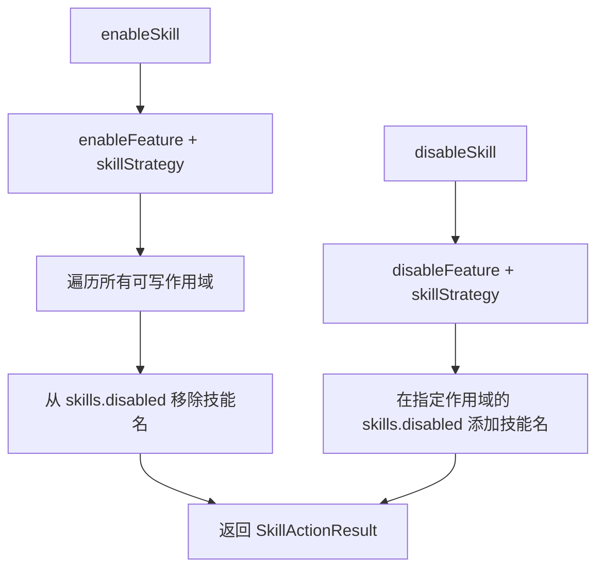

# skillSettings.ts

> 技能（Skill）的启用/禁用设置管理

## 概述

`skillSettings.ts` 基于通用的功能切换框架（`featureToggleUtils`）实现了技能的启用和禁用逻辑。技能通过将名称添加到 `skills.disabled` 数组来禁用、从数组中移除来启用。模块定义了 `skillStrategy` 策略对象，将技能特定的启用/禁用逻辑注入到通用功能切换工具中。

## 架构图（mermaid）

## 主要导出

| 导出名 | 类型 | 说明 |
|--------|------|------|
| `ModifiedScope` | `type`（重导出） | 被修改的设置作用域信息 |
| `SkillActionStatus` | `type` | 操作状态：`'success'` / `'no-op'` / `'error'` |
| `SkillActionResult` | `interface` | 技能操作结果，含 skillName、action、status、modifiedScopes 等 |
| `enableSkill` | `(settings, skillName) => SkillActionResult` | 在所有可写作用域中启用技能 |
| `disableSkill` | `(settings, skillName, scope) => SkillActionResult` | 在指定作用域中禁用技能 |

## 核心逻辑

`skillStrategy` 实现了 `FeatureToggleStrategy` 接口的四个方法：
1. **needsEnabling** - 检查指定作用域的 `skills.disabled` 是否包含该技能名。
2. **enable** - 从 `skills.disabled` 数组中过滤移除该技能名。
3. **isExplicitlyDisabled** - 检查当前作用域是否明确禁用了该技能。
4. **disable** - 将技能名追加到 `skills.disabled` 数组。

## 内部依赖

| 模块 | 用途 |
|------|------|
| `../config/settings.js` | `SettingScope`、`LoadedSettings` 类型 |
| `./featureToggleUtils.js` | `FeatureActionResult`、`FeatureToggleStrategy`、`enableFeature`、`disableFeature` |

## 外部依赖

无。
