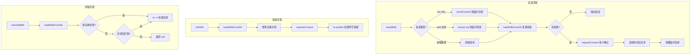

# skillUtils.ts

> 技能安装、链接、卸载和操作反馈渲染的核心工具集

## 概述

`skillUtils.ts` 提供了技能（Skill）生命周期管理的核心逻辑，约 300 行。包含四大功能：

1. **renderSkillActionFeedback** - 将技能启用/禁用操作结果渲染为人类可读的反馈文本。
2. **installSkill** - 从 Git URL、`.skill` 压缩文件或本地路径安装技能到用户或工作区目录。
3. **linkSkill** - 通过符号链接将本地技能目录链接到安装目录。
4. **uninstallSkill** - 按名称卸载已安装的技能。

## 架构图（mermaid）

## 主要导出

| 导出名 | 类型 | 说明 |
|--------|------|------|
| `renderSkillActionFeedback` | `(result, formatScope) => string` | 将技能操作结果渲染为反馈文本 |
| `installSkill` | `(source, scope, subpath, onLog, requestConsent?) => Promise<Array<{name, location}>>` | 从远程或本地安装技能 |
| `linkSkill` | `(source, scope, onLog, requestConsent?) => Promise<Array<{name, location}>>` | 通过符号链接安装本地技能 |
| `uninstallSkill` | `(name, scope) => Promise<{location} \| null>` | 按名称卸载技能 |

## 核心逻辑

### installSkill
1. 判断来源类型：Git URL（`git@`/`http(s)://`）、`.skill` 文件、或本地路径。
2. Git 来源使用 `cloneFromGit` 克隆到临时目录；`.skill` 文件用 `extract-zip` 解压。
3. 支持 `subpath` 参数指定子路径，并进行路径遍历安全检查。
4. `loadSkillsFromDir` 在目录中发现 SKILL.md 定义的技能。
5. 通过 `requestConsent` 回调获取用户确认。
6. 已存在的同名技能会被覆盖。最后清理临时目录。

### linkSkill
- 检查技能名称是否冲突（同一来源中不允许重名）。
- 使用 `fs.symlink` 创建目录符号链接，已存在时先删除再重建。

### uninstallSkill
- 先通过 `loadSkillsFromDir` 精确匹配技能名称，找不到时回退到目录名匹配。
- 对回退路径进行路径遍历安全检查。

## 内部依赖

| 模块 | 用途 |
|------|------|
| `../config/settings.js` | `SettingScope` |
| `./skillSettings.js` | `SkillActionResult` 类型 |
| `../config/extensions/github.js` | `cloneFromGit` - Git 仓库克隆 |

## 外部依赖

| 包名 | 用途 |
|------|------|
| `node:fs/promises` | 文件系统操作（mkdtemp、cp、symlink、rm、stat、lstat） |
| `node:path` | 路径操作 |
| `node:os` | `tmpdir` - 获取临时目录 |
| `extract-zip` | 解压 `.skill` 文件 |
| `@google/gemini-cli-core` | `Storage`、`loadSkillsFromDir`、`SkillDefinition` |
