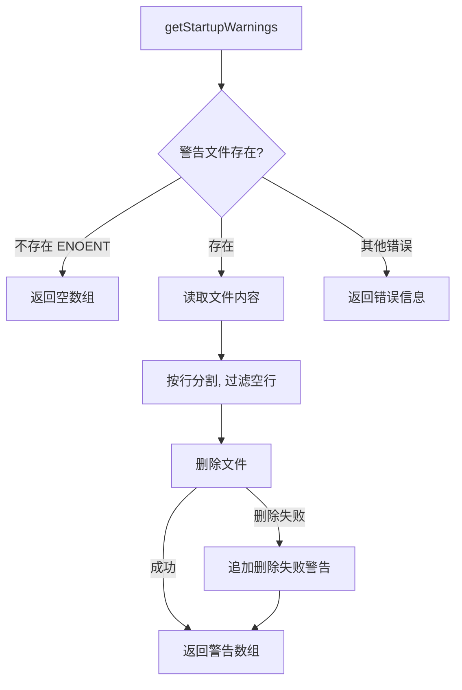

# startupWarnings.ts

> 从临时文件中读取并清理 CLI 启动警告信息

## 概述

`startupWarnings.ts` 提供了 `getStartupWarnings` 函数，用于从临时目录中的警告文件（`gemini-cli-warnings.txt`）读取启动时的警告信息。这些警告通常由之前的 CLI 进程写入（例如自动更新过程中产生的警告）。读取后文件会被立即删除，实现"一次读取，读后即删"的语义。

## 架构图（mermaid）

## 主要导出

| 导出名 | 类型 | 说明 |
|--------|------|------|
| `getStartupWarnings` | `() => Promise<string[]>` | 读取并删除启动警告文件，返回警告消息数组 |

## 核心逻辑

1. 警告文件路径为 `os.tmpdir() + '/gemini-cli-warnings.txt'`。
2. 通过 `fs.access` 检查文件是否存在。
3. 存在时读取内容并按 `\n` 分割，过滤空行。
4. 读取后立即尝试删除文件，删除失败时在返回的警告列表中追加提示。
5. 文件不存在（`ENOENT`）时返回空数组；其他文件系统错误返回错误描述。

## 内部依赖

无。

## 外部依赖

| 包名 | 用途 |
|------|------|
| `node:fs/promises` | 异步文件操作（access、readFile、unlink） |
| `node:os` | `tmpdir` - 获取临时目录路径 |
| `node:path` | `join` - 路径拼接 |
| `@google/gemini-cli-core` | `getErrorMessage` - 统一的错误消息提取 |
