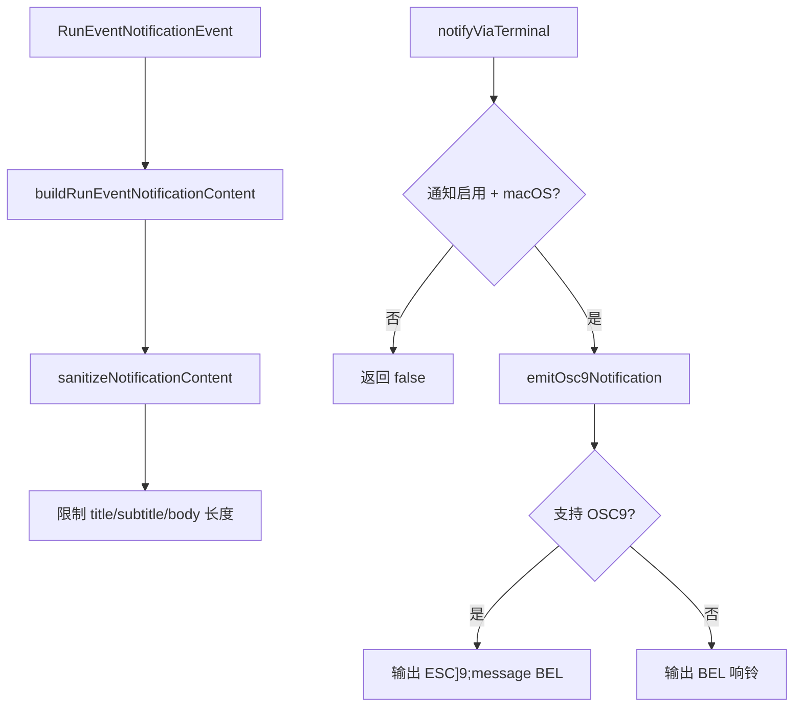

# terminalNotifications.ts

> 通过终端 OSC9 序列或系统铃声发送桌面通知

## 概述

`terminalNotifications.ts` 实现了 CLI 的终端通知系统，约 127 行。支持在 macOS 上通过 OSC9 终端转义序列或退退化为 BEL 响铃发送桌面通知。通知内容经过严格的长度限制和安全清洗处理。主要用于在会话完成或需要用户关注时发送提醒。

## 架构图（mermaid）

## 主要导出

| 导出名 | 类型 | 说明 |
|--------|------|------|
| `MAX_NOTIFICATION_TITLE_CHARS` | `number` (48) | 标题最大字符数 |
| `MAX_NOTIFICATION_SUBTITLE_CHARS` | `number` (64) | 副标题最大字符数 |
| `MAX_NOTIFICATION_BODY_CHARS` | `number` (180) | 正文最大字符数 |
| `RunEventNotificationContent` | `interface` | 通知内容结构：title、subtitle?、body |
| `RunEventNotificationEvent` | `type` | 通知事件：`attention`（需关注）或 `session_complete`（会话完成） |
| `buildRunEventNotificationContent` | `(event) => RunEventNotificationContent` | 根据事件类型构建通知内容 |
| `isNotificationsEnabled` | `(settings) => boolean` | 检查通知是否已在设置中启用（仅 macOS） |
| `notifyViaTerminal` | `(enabled, content) => Promise<boolean>` | 发送终端通知 |

## 核心逻辑

1. **内容构建** - `buildRunEventNotificationContent` 根据事件类型生成标题和正文，`attention` 类型提示需要用户操作，`session_complete` 提示会话结束。
2. **内容清洗** - `sanitizeNotificationContent` 通过 `sanitizeForDisplay` 对 title/subtitle/body 分别进行长度截断和安全处理，空值使用默认文本。
3. **OSC9 协议** - 格式为 `\x1b]9;<title> | <subtitle> | <body>\x07`，三段通过 ` | ` 连接，总长度限制为 `MAX_OSC9_MESSAGE_CHARS`。
4. **降级处理** - 终端不支持 OSC9 时仅输出 BEL（`\x07`）响铃。
5. **启用判断** - 仅在 macOS 平台且设置中 `enableNotifications` 或 `enableMacOsNotifications` 为 true 时生效。

## 内部依赖

| 模块 | 用途 |
|------|------|
| `../config/settings.js` | `LoadedSettings` 类型 |
| `../ui/utils/textUtils.js` | `sanitizeForDisplay` - 安全清洗文本 |
| `../ui/utils/terminalCapabilityManager.js` | `TerminalCapabilityManager` - 检测终端 OSC9 支持 |

## 外部依赖

| 包名 | 用途 |
|------|------|
| `@google/gemini-cli-core` | `debugLogger`、`writeToStdout` |
