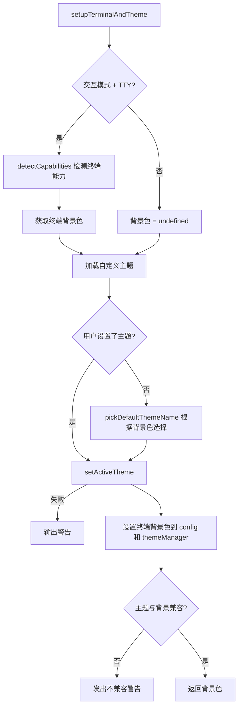

# terminalTheme.ts

> 检测终端能力并设置 CLI 主题

## 概述

`terminalTheme.ts` 提供了 `setupTerminalAndTheme` 函数，在 CLI 启动时完成终端能力检测和主题初始化。它先检测终端的 Kitty 协议支持和背景色，然后加载自定义主题，根据用户设置或终端背景色自动选择合适的主题，最后验证所选主题与终端背景的兼容性并给出提示。

## 架构图（mermaid）

## 主要导出

| 导出名 | 类型 | 说明 |
|--------|------|------|
| `setupTerminalAndTheme` | `(config: Config, settings: LoadedSettings) => Promise<TerminalBackgroundColor>` | 初始化终端能力检测和主题设置，返回检测到的背景色 |

## 核心逻辑

1. 仅在交互模式（`config.isInteractive()`）且 stdin 为 TTY 时执行终端能力检测。
2. 加载用户自定义主题 `settings.merged.ui.customThemes`。
3. 主题选择优先级：用户明确设置 > 根据终端背景色自动选择（亮/暗背景对应不同默认主题）。
4. 检测主题类型（dark/light）与终端背景色是否匹配，不匹配时通过 `coreEvents.emitFeedback` 发出警告。

## 内部依赖

| 模块 | 用途 |
|------|------|
| `../ui/utils/terminalCapabilityManager.js` | 终端能力检测（背景色、Kitty 协议） |
| `../ui/themes/theme-manager.js` | `themeManager`、`DEFAULT_THEME` - 主题管理 |
| `../ui/themes/theme.js` | `pickDefaultThemeName` - 根据背景色选择默认主题 |
| `../ui/themes/color-utils.js` | `getThemeTypeFromBackgroundColor` - 背景色分类 |
| `../config/settings.js` | `LoadedSettings` 类型 |

## 外部依赖

| 包名 | 用途 |
|------|------|
| `@google/gemini-cli-core` | `Config`、`coreEvents`、`debugLogger` |
