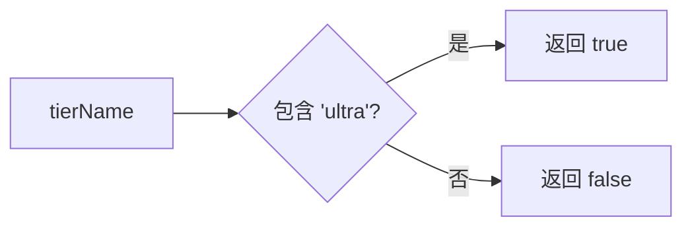

# tierUtils.ts

> 判断用户是否为 Ultra 级别订阅的工具函数

## 概述

`tierUtils.ts` 是一个极简工具模块，仅导出 `isUltraTier` 函数，通过检查用户层级名称是否包含 `'ultra'`（不区分大小写）来判断用户是否为 Ultra 级别订阅者。

## 架构图（mermaid）

## 主要导出

| 导出名 | 类型 | 说明 |
|--------|------|------|
| `isUltraTier` | `(tierName?: string) => boolean` | 判断层级名称是否为 Ultra 级别 |

## 核心逻辑

使用 `tierName?.toLowerCase().includes('ultra')` 进行不区分大小写的子串匹配。`tierName` 为 `undefined` 时返回 `false`。

## 内部依赖

无。

## 外部依赖

无。
