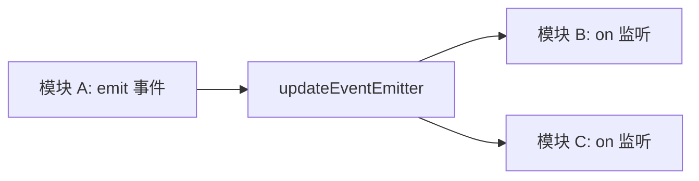

# updateEventEmitter.ts

> 应用级共享事件发射器，用于解耦模块间通信

## 概述

`updateEventEmitter.ts` 是一个极简模块，导出一个全局共享的 `EventEmitter` 实例 `updateEventEmitter`。它作为 CLI 内部解耦模块之间通信的发布-订阅通道，典型使用场景包括自动更新完成通知等跨模块事件传递。

## 架构图（mermaid）

## 主要导出

| 导出名 | 类型 | 说明 |
|--------|------|------|
| `updateEventEmitter` | `EventEmitter` | 全局共享的事件发射器实例 |

## 核心逻辑

直接实例化：`export const updateEventEmitter = new EventEmitter();`

## 内部依赖

无。

## 外部依赖

| 包名 | 用途 |
|------|------|
| `node:events` | `EventEmitter` - Node.js 事件发射器 |
