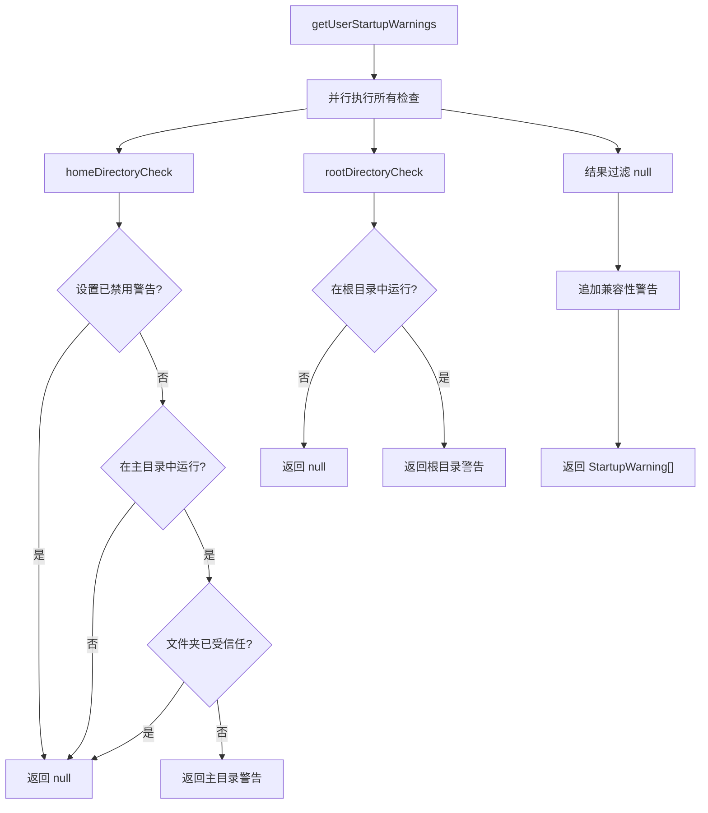

# userStartupWarnings.ts

> 检测用户运行环境并生成启动时的安全警告

## 概述

`userStartupWarnings.ts` 提供了 `getUserStartupWarnings` 函数，在 CLI 启动时执行一系列环境检查并返回警告列表。当前内置两项检查：在用户主目录中运行的警告（低优先级）和在根目录中运行的警告（高优先级）。还集成了终端兼容性警告检测。

## 架构图（mermaid）

## 主要导出

| 导出名 | 类型 | 说明 |
|--------|------|------|
| `getUserStartupWarnings` | `(settings, workspaceRoot?, options?) => Promise<StartupWarning[]>` | 执行环境检查并返回启动警告列表 |

## 核心逻辑

### 主目录检查（homeDirectoryCheck）
- 优先级：Low
- 可通过 `settings.ui.showHomeDirectoryWarning = false` 禁用。
- 比较工作区真实路径与主目录真实路径。
- 若文件夹信任已启用且工作区已受信任，则不显示警告。

### 根目录检查（rootDirectoryCheck）
- 优先级：High
- 检查工作区路径的父目录是否等于自身（即为文件系统根目录）。
- 在根目录运行时警告用户整个文件系统结构将被用作上下文。

### 兼容性警告
- 当 `settings.ui.showCompatibilityWarnings` 未设为 false 时，调用 `getCompatibilityWarnings` 获取终端兼容性警告。

## 内部依赖

| 模块 | 用途 |
|------|------|
| `../config/settingsSchema.js` | `Settings` 类型 |
| `../config/trustedFolders.js` | `isFolderTrustEnabled`、`isWorkspaceTrusted` - 文件夹信任检查 |

## 外部依赖

| 包名 | 用途 |
|------|------|
| `node:fs/promises` | `realpath` - 获取真实路径 |
| `node:path` | `dirname` - 获取父目录 |
| `node:process` | `cwd` - 获取当前工作目录 |
| `@google/gemini-cli-core` | `homedir`、`getCompatibilityWarnings`、`WarningPriority`、`StartupWarning` |
