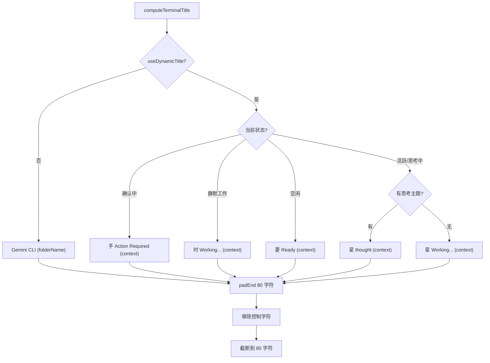

# windowTitle.ts

> 根据 CLI 当前状态动态计算终端窗口标题

## 概述

`windowTitle.ts` 提供了 `computeTerminalTitle` 函数，根据 CLI 的实时状态（空闲、工作中、等待确认、思考中等）生成格式化的终端窗口标题。标题固定为 80 字符宽度（不足时填充空格），以防止任务栏图标因标题长度变化而抖动。支持静态模式和动态模式两种标题风格。

## 架构图（mermaid）

## 主要导出

| 导出名 | 类型 | 说明 |
|--------|------|------|
| `TerminalTitleOptions` | `interface` | 标题计算所需的状态选项 |
| `computeTerminalTitle` | `(options: TerminalTitleOptions) => string` | 根据 CLI 状态计算 80 字符宽的终端标题 |

## 核心逻辑

1. **上下文来源** - 优先使用 `CLI_TITLE` 环境变量，其次使用 `folderName`。
2. **静态模式** - `useDynamicTitle = false` 时固定显示 `Gemini CLI (context)`。
3. **动态模式** - 根据状态优先级：确认中 > 静默工作 > 空闲 > 活跃/思考中。
4. **智能截断** - 当思考主题过长无法同时显示上下文后缀时，省略后缀以最大化思考内容显示空间。使用 `truncate` 函数截断并添加省略号。
5. **安全处理** - 移除标题中的 ASCII 控制字符（`\x00-\x1F` 和 `\x7F`），防止终端显示异常。
6. **固定宽度** - 最终结果 padEnd 到 80 字符并截断，防止任务栏抖动。

## 内部依赖

| 模块 | 用途 |
|------|------|
| `../ui/types.js` | `StreamingState` - 流式状态枚举 |

## 外部依赖

无。
