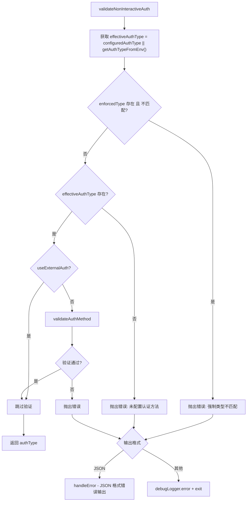

# validateNonInterActiveAuth.ts

> 在非交互式模式下验证认证配置的有效性，确保认证类型已设置且符合管理员强制策略。

## 概述

`validateNonInterActiveAuth.ts` 提供了非交互式模式专用的认证验证函数。与交互式模式不同，非交互式模式无法弹出认证对话框让用户手动选择认证方式，因此必须在启动时严格校验认证配置。该函数检查以下内容：

1. 管理员强制认证类型（`enforcedType`）是否匹配。
2. 是否配置了有效的认证类型（来自设置或环境变量）。
3. 认证方法本身是否合法（非外部认证时）。

若校验失败，根据输出格式以 JSON 错误或 stderr 日志的形式报告错误，并以 `FATAL_AUTHENTICATION_ERROR` 退出码终止进程。

## 架构图（mermaid）

## 主要导出

| 导出 | 类型 | 说明 |
|---|---|---|
| `validateNonInteractiveAuth` | 异步函数 | 验证非交互式认证配置，返回有效的 `AuthType` 或终止进程 |

## 核心逻辑

`validateNonInteractiveAuth(configuredAuthType, useExternalAuth, nonInteractiveConfig, settings)` 的执行流程：

| 步骤 | 说明 |
|---|---|
| 确定有效认证类型 | 优先使用 `configuredAuthType`（来自设置），回退到 `getAuthTypeFromEnv()`（来自环境变量如 `GEMINI_API_KEY`、`GOOGLE_GENAI_USE_VERTEXAI` 等） |
| 管理员策略检查 | 若 `settings.merged.security.auth.enforcedType` 存在且与当前类型不匹配，抛出错误 |
| 认证类型存在性检查 | 若 `effectiveAuthType` 为空，提示用户在设置文件或环境变量中配置认证方法 |
| 认证方法合法性检查 | 若非外部认证（`useExternalAuth` 为 false），调用 `validateAuthMethod` 校验认证方法是否合法 |
| 错误处理 | JSON 输出格式下通过 `handleError` 输出结构化错误；其他格式通过 `debugLogger.error` 输出到 stderr，然后执行清理并退出 |

## 内部依赖

| 模块 | 用途 |
|---|---|
| `./config/settings.js` | 提供 `USER_SETTINGS_PATH` 常量和 `LoadedSettings` 类型 |
| `./config/auth.js` | 提供 `validateAuthMethod` 认证方法校验函数 |
| `./utils/errors.js` | 提供 `handleError` 错误处理函数 |
| `./utils/cleanup.js` | 提供 `runExitCleanup` 退出清理函数 |

## 外部依赖

| 模块 | 用途 |
|---|---|
| `@google/gemini-cli-core` | 提供 `debugLogger`（调试日志）、`OutputFormat`（输出格式枚举）、`ExitCodes`（退出码常量）、`getAuthTypeFromEnv`（从环境变量获取认证类型）、`Config`、`AuthType` 类型 |
