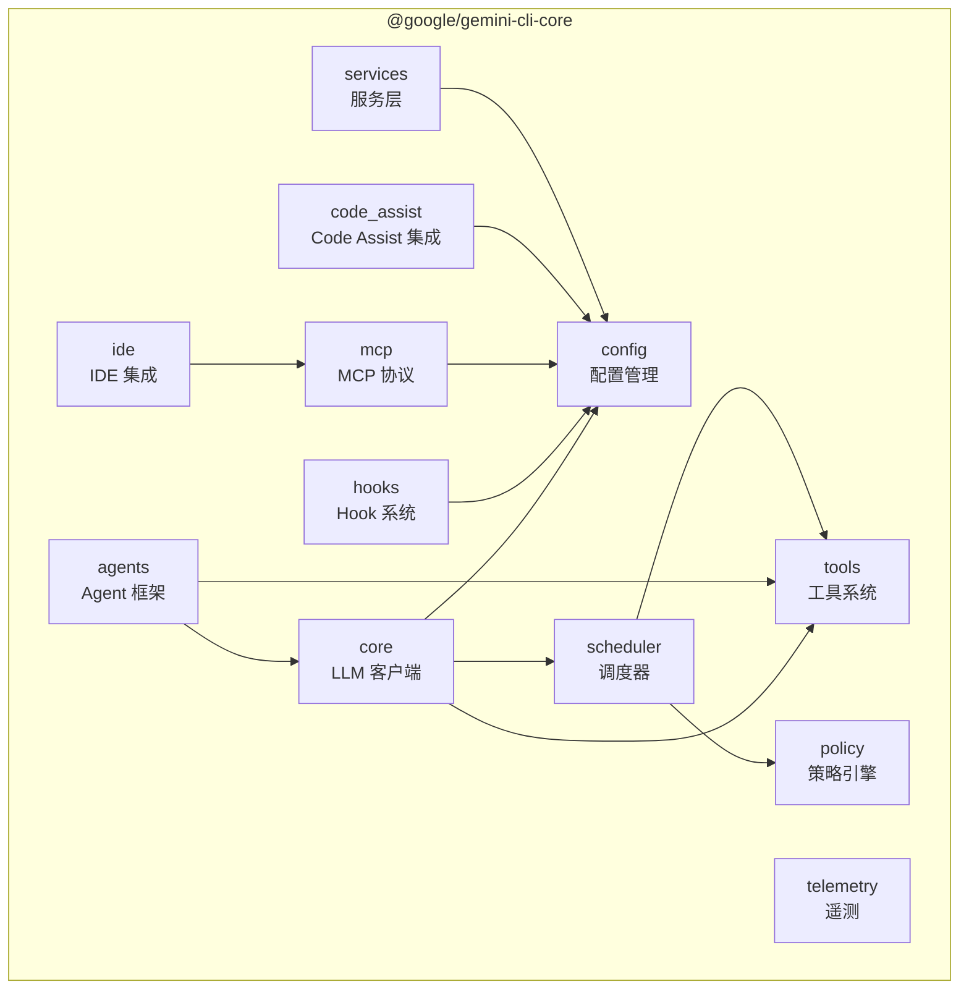

# core 架构

> Gemini CLI 的核心引擎包，提供 LLM 交互、工具系统、Agent 框架、配置管理等所有底层能力

## 概述

`@google/gemini-cli-core` 是整个 Gemini CLI 生态系统的基础包。它封装了与 Gemini API 的通信、工具注册与执行、Agent（子代理）系统、MCP 协议支持、策略引擎、Hook 系统、IDE 集成等核心功能。CLI、SDK 和 A2A 服务器均建立在此包之上。该包采用 ESM 模块格式，要求 Node.js >= 20。

## 架构图



## 目录结构

```
packages/core/
├── package.json          # 包定义，约 60+ 依赖
├── src/
│   ├── index.ts          # 主入口，统一导出所有公共 API
│   ├── agents/           # Agent（子代理）系统
│   ├── availability/     # 模型可用性检查
│   ├── billing/          # 计费与配额管理
│   ├── code_assist/      # Google Code Assist 集成
│   ├── commands/         # 命令定义
│   ├── config/           # 配置管理系统
│   ├── confirmation-bus/ # 确认消息总线
│   ├── core/             # LLM 客户端与会话管理
│   ├── fallback/         # 模型降级策略
│   ├── hooks/            # Hook 事件系统
│   ├── ide/              # IDE 集成
│   ├── mcp/              # MCP 协议实现
│   ├── output/           # 输出格式化
│   ├── policy/           # 工具执行策略引擎
│   ├── prompts/          # Prompt 模板管理
│   ├── resources/        # 资源注册
│   ├── routing/          # 模型路由
│   ├── safety/           # 安全检查
│   ├── scheduler/        # 工具调度器
│   ├── services/         # 核心服务
│   ├── skills/           # 技能系统
│   ├── telemetry/        # 遥测与监控
│   ├── tools/            # 内置工具
│   ├── utils/            # 通用工具函数
│   └── voice/            # 语音响应格式化
```

## 关键文件

| 文件 | 功能 |
|------|------|
| `src/index.ts` | 主导出入口，聚合所有公共 API |
| `package.json` | 包定义，声明 60+ 生产依赖 |

## 内部依赖

无（core 是最底层包）

## 外部依赖

| 依赖 | 用途 |
|------|------|
| `@google/genai` | Google Generative AI SDK，与 Gemini API 通信 |
| `@modelcontextprotocol/sdk` | MCP 协议实现 |
| `@a2a-js/sdk` | Agent-to-Agent 协议 |
| `@opentelemetry/*` | 可观测性框架（链路追踪、指标、日志） |
| `google-auth-library` | Google OAuth 认证 |
| `zod` | 运行时 schema 验证 |
| `js-yaml` | YAML 解析（Agent 定义文件） |
| `simple-git` | Git 操作 |
| `web-tree-sitter` | 代码语法分析 |
| `diff` | 文件差异比较 |
| `marked` | Markdown 渲染 |
| `undici` | HTTP 客户端 |
