# core/src 架构

> core 包的源码根目录，通过 index.ts 统一导出所有公共模块

## 概述

`src/` 是 `@google/gemini-cli-core` 包的源码目录。`index.ts` 作为唯一的公共入口文件，选择性地从 20+ 个子模块中导出类型、类、函数和常量。这种集中导出模式确保了清晰的 API 边界——消费者只需从 `@google/gemini-cli-core` 导入，无需了解内部目录结构。

## 架构图

```mermaid
graph TD
    INDEX["index.ts<br/>统一导出入口"]

    INDEX --> CONFIG["config/ 配置"]
    INDEX --> CORE["core/ LLM 客户端"]
    INDEX --> TOOLS["tools/ 工具"]
    INDEX --> AGENTS["agents/ Agent"]
    INDEX --> MCP["mcp/ MCP 协议"]
    INDEX --> HOOKS["hooks/ Hook"]
    INDEX --> POLICY["policy/ 策略"]
    INDEX --> SCHEDULER["scheduler/ 调度"]
    INDEX --> SERVICES["services/ 服务"]
    INDEX --> CODE_ASSIST["code_assist/ Code Assist"]
    INDEX --> BILLING["billing/ 计费"]
    INDEX --> COMMANDS["commands/ 命令"]
    INDEX --> CONFIRMATION["confirmation-bus/ 消息总线"]
    INDEX --> FALLBACK["fallback/ 降级"]
    INDEX --> OUTPUT["output/ 输出"]
    INDEX --> IDE["ide/ IDE"]
    INDEX --> TELEMETRY["telemetry/ 遥测"]
    INDEX --> UTILS["utils/ 工具函数"]
    INDEX --> SKILLS["skills/ 技能"]
    INDEX --> RESOURCES["resources/ 资源"]
    INDEX --> PROMPTS["prompts/ Prompt"]
    INDEX --> VOICE["voice/ 语音"]
```

## 目录结构

| 子目录 | 功能 |
|--------|------|
| `agents/` | Agent（子代理）系统：本地/远程 Agent 的定义、加载、注册、执行 |
| `availability/` | 模型可用性服务：健康状态跟踪、模型选择、策略链 |
| `billing/` | 计费管理：AI 积分余额、超额策略 |
| `code_assist/` | Google Code Assist 集成：OAuth 认证、服务器通信、管理员控制 |
| `commands/` | CLI 命令定义：扩展管理、会话恢复、初始化、记忆管理 |
| `config/` | 配置系统：全局配置类、模型配置、存储、常量 |
| `confirmation-bus/` | 确认消息总线：工具确认请求/响应、策略决策分发 |
| `core/` | 核心 LLM 客户端：GeminiClient、GeminiChat、内容生成、Turn 管理 |
| `fallback/` | 模型降级策略：失败处理、UI 交互意图 |
| `hooks/` | Hook 事件系统：生命周期钩子注册、执行、聚合 |
| `ide/` | IDE 集成：IDE 检测、MCP 客户端、上下文管理 |
| `mcp/` | MCP 协议实现：OAuth 提供者、Token 存储 |
| `output/` | 输出格式化：JSON 输出、流式 JSON 输出 |
| `policy/` | 策略引擎：工具执行权限、TOML 规则加载 |
| `prompts/` | Prompt 模板管理 |
| `resources/` | 资源注册中心 |
| `routing/` | 模型路由策略 |
| `safety/` | 安全检查 |
| `scheduler/` | 工具调度器：并行执行、确认流程 |
| `services/` | 核心服务：文件发现、Git、沙箱、会话录制等 |
| `skills/` | 技能系统：技能加载与管理 |
| `telemetry/` | 遥测与监控：OpenTelemetry 集成 |
| `tools/` | 内置工具：文件操作、Shell、搜索、Web 等 |
| `utils/` | 通用工具函数：路径、错误、重试、格式化等 |
| `voice/` | 语音响应格式化 |

## 关键文件

| 文件 | 功能 |
|------|------|
| `index.ts` | 统一导出入口，包含 200+ 行 export 语句，覆盖全部公共 API |

## 内部依赖

所有子目录之间存在丰富的内部依赖关系，`index.ts` 汇聚并重新导出。

## 外部依赖

通过 `index.ts` 还重新导出了 `@google/genai` 的类型（`Content`、`Part`、`FunctionCall`），为消费者提供便利。
