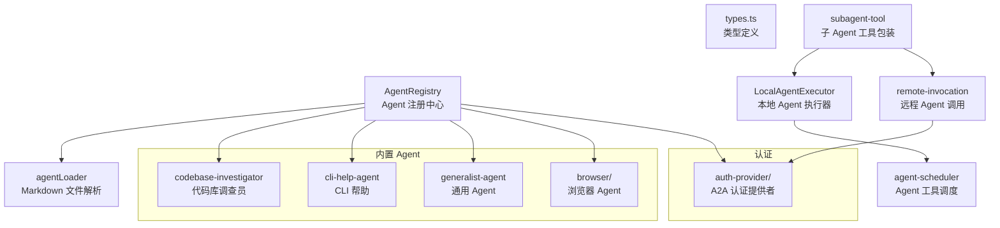

# agents 架构

> Agent（子代理）系统，支持本地 LLM Agent 和远程 A2A Agent 的定义、加载、注册与执行

## 概述

`agents/` 模块实现了 Gemini CLI 的子代理（Subagent）架构。Agent 是独立的 LLM 执行单元，拥有自己的系统提示、工具集和运行约束。系统支持两种 Agent 类型：**本地 Agent**（使用 LLM 循环在本地执行）和**远程 Agent**（通过 A2A 协议与外部服务通信）。Agent 定义通过 Markdown 文件（带 YAML frontmatter）声明，由 AgentRegistry 统一管理。

## 架构图



## 目录结构

```
agents/
├── types.ts                    # 核心类型：AgentDefinition、PromptConfig、RunConfig 等
├── agentLoader.ts              # 从 Markdown 文件解析 Agent 定义
├── registry.ts                 # AgentRegistry：Agent 发现、注册、生命周期管理
├── local-executor.ts           # LocalAgentExecutor：本地 Agent 的 LLM 循环执行
├── local-invocation.ts         # 本地 Agent 调用入口
├── remote-invocation.ts        # 远程 A2A Agent 调用
├── agent-scheduler.ts          # Agent 工具调度（桥接到 Scheduler）
├── subagent-tool.ts            # 将 Agent 包装为可调用的工具
├── subagent-tool-wrapper.ts    # 子 Agent 工具的确认流程包装
├── a2a-client-manager.ts       # A2A 客户端管理器
├── a2a-errors.ts               # A2A 相关错误类型
├── a2aUtils.ts                 # A2A 工具函数
├── acknowledgedAgents.ts       # 项目级 Agent 确认记录管理
├── utils.ts                    # 通用工具函数（模板字符串等）
├── codebase-investigator.ts    # 内置：代码库调查 Agent
├── cli-help-agent.ts           # 内置：CLI 帮助 Agent
├── generalist-agent.ts         # 内置：通用任务 Agent
├── auth-provider/              # A2A 认证提供者工厂
└── browser/                    # 浏览器自动化 Agent
```

## 关键文件

| 文件 | 功能 |
|------|------|
| `types.ts` | 定义 `AgentDefinition`（LocalAgentDefinition / RemoteAgentDefinition）、`AgentTerminateMode`、`OutputObject` 等核心类型 |
| `agentLoader.ts` | 解析 Markdown + YAML frontmatter 格式的 Agent 定义文件，支持 Zod schema 验证 |
| `registry.ts` | `AgentRegistry` 类：从用户目录/项目目录/扩展中发现并注册 Agent，管理内置 Agent，处理 Agent 确认和策略分配 |
| `local-executor.ts` | `LocalAgentExecutor` 类：实现完整的 Agent 执行循环——创建隔离工具注册表、调用 LLM、处理工具调用、管理超时与恢复 |
| `agent-scheduler.ts` | `scheduleAgentTools` 函数：为 Agent 创建独立的 Scheduler 实例来执行工具调用 |
| `subagent-tool.ts` | 将 Agent 定义包装为 `delegate_to_agent` 工具，使主 Agent 可以委派任务 |

## 内部依赖

- `config/` - 配置访问（Config 类）
- `core/` - GeminiChat、GeminiClient
- `tools/` - ToolRegistry、工具类型
- `scheduler/` - Scheduler 调度器
- `confirmation-bus/` - 消息总线
- `policy/` - PolicyDecision
- `telemetry/` - Agent 事件日志
- `utils/` - 错误处理、事件系统、调试日志

## 外部依赖

| 依赖 | 用途 |
|------|------|
| `@google/genai` | Gemini API 类型 |
| `@a2a-js/sdk` | A2A 协议客户端 |
| `zod` | Agent 定义 schema 验证 |
| `zod-to-json-schema` | 输出 schema 转换为 JSON Schema |
| `js-yaml` | YAML frontmatter 解析 |
| `ajv` | JSON Schema 验证（inputConfig） |
