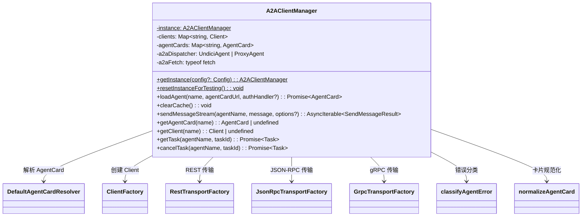

# a2a-client-manager.ts

> 管理与远程 A2A (Agent-to-Agent) 代理的通信客户端，包括协议协商、认证和传输选择。

## 概述

该文件实现了 `A2AClientManager` 单例类，是 Gemini CLI 与远程 A2A 代理通信的核心管理器。它负责：

1. 加载远程代理的 AgentCard（代理描述卡片）并缓存客户端实例。
2. 根据代理支持的传输协议（REST、JSON-RPC、gRPC）自动选择合适的传输方式。
3. 处理认证流程（支持带认证的 fetch 和无认证的 fetch 两种策略）。
4. 提供流式消息发送、任务获取和任务取消等操作接口。

在整个 agents 模块中，该文件扮演"远程代理客户端工厂与管理器"的角色，是远程代理调用链路的入口。

## 架构图



## 主要导出

### 类型 `SendMessageResult`

```typescript
export type SendMessageResult =
  | Message
  | Task
  | TaskStatusUpdateEvent
  | TaskArtifactUpdateEvent;
```

发送消息后可能返回的结果类型联合，包含完整消息、任务对象，或增量式的状态/产物更新事件。

### 类 `A2AClientManager`

单例模式的 A2A 客户端管理器。

#### `static getInstance(config?: Config): A2AClientManager`

获取单例实例。首次调用时根据 `Config` 中的代理设置初始化 HTTP dispatcher（支持代理服务器）。

#### `static resetInstanceForTesting(): void`

仅用于测试，重置单例实例。

#### `async loadAgent(name: string, agentCardUrl: string, authHandler?: AuthenticationHandler): Promise<AgentCard>`

加载远程代理：
1. 先尝试无认证请求获取 AgentCard，若返回 401/403 则带认证重试。
2. 对 AgentCard 执行 `normalizeAgentCard` 规范化处理。
3. 根据 AgentCard 声明的传输接口（REST/JSON-RPC/gRPC）创建对应的 Client。
4. 缓存 Client 和 AgentCard 到内部 Map 中。

#### `clearCache(): void`

清除所有已缓存的客户端和 AgentCard。

#### `async *sendMessageStream(agentName, message, options?): AsyncIterable<SendMessageResult>`

向指定代理流式发送消息。使用 `yield*` 委托给底层 `client.sendMessageStream`，支持通过 `contextId` 和 `taskId` 维持对话状态。

#### `getAgentCard(name: string): AgentCard | undefined`

获取已缓存的代理卡片。

#### `getClient(name: string): Client | undefined`

获取已缓存的客户端实例。

#### `async getTask(agentName: string, taskId: string): Promise<Task>`

从指定代理检索任务详情。

#### `async cancelTask(agentName: string, taskId: string): Promise<Task>`

取消指定代理上的任务。

## 核心逻辑

### 超时与传输层初始化

常量 `A2A_TIMEOUT = 1800000`（30 分钟）用于远程代理通信超时，因为远程代理（如 Deep Research）可能需要 10 分钟以上。构造函数中根据是否配置了代理服务器，创建 `ProxyAgent` 或 `UndiciAgent` 作为 HTTP dispatcher，并包装成自定义 `a2aFetch`。

### AgentCard 解析与客户端创建

`loadAgent` 中采用"先无认证，再带认证"的双阶段策略获取 AgentCard，避免某些服务器因意外的认证头返回 400 错误。随后使用 `ClientFactory` 按传输协议优先级（REST → JSON-RPC → gRPC）创建客户端。对于 gRPC，会检查 URL 协议来决定使用 SSL 还是非安全凭证。

### 流式消息传递

`sendMessageStream` 是一个异步生成器函数，通过 `yield*` 直接委托给底层 SDK 客户端，保持了流式响应的零拷贝传递。

## 内部依赖

| 模块 | 用途 |
|------|------|
| `./a2aUtils.js` | `normalizeAgentCard` — AgentCard 字段名规范化 |
| `../config/config.js` | `Config` 类型 — 读取代理服务器等配置 |
| `../utils/debugLogger.js` | `debugLogger` — 调试日志输出 |
| `./a2a-errors.js` | `classifyAgentError` — 对代理错误进行分类包装 |

## 外部依赖

| 包名 | 用途 |
|------|------|
| `@a2a-js/sdk` | A2A 协议核心类型（AgentCard, Message, Task 等） |
| `@a2a-js/sdk/client` | 客户端工厂、传输工厂、AgentCard 解析器、认证 fetch |
| `@a2a-js/sdk/client/grpc` | gRPC 传输工厂 |
| `@grpc/grpc-js` | gRPC 凭证创建（SSL / Insecure） |
| `uuid` | 生成消息唯一 ID（v4） |
| `undici` | HTTP dispatcher（Agent / ProxyAgent），支持自定义超时 |
