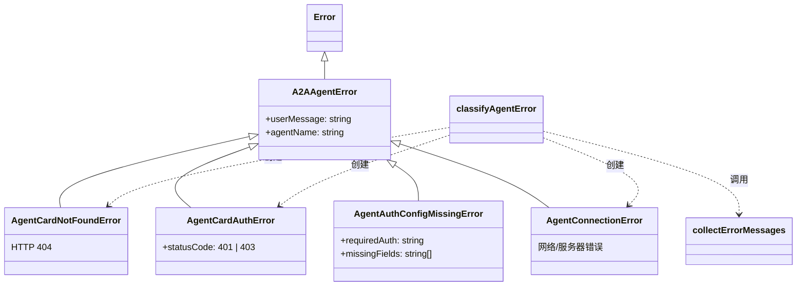

# a2a-errors.ts

> 定义 A2A 远程代理操作的自定义错误类型层次结构，提供结构化、用户友好的错误信息。

## 概述

该文件为 A2A 远程代理通信中常见的失败模式（如 AgentCard 获取失败、认证失败、网络连接错误）提供了类型化的错误类层次结构。每个错误类都携带 `userMessage` 字段，用于在 CLI 中向用户展示可读性强的错误提示。

此外，文件还提供了 `classifyAgentError` 工具函数，能够将 A2A SDK 抛出的原始错误通过模式匹配自动分类为具体的错误子类，是错误处理链的核心环节。

## 架构图



## 主要导出

### 类 `A2AAgentError`

所有 A2A 代理错误的基类，继承自 `Error`。

| 属性 | 类型 | 说明 |
|------|------|------|
| `userMessage` | `string` | 适合 CLI 显示的用户友好消息 |
| `agentName` | `string` | 关联的代理名称 |

### 类 `AgentCardNotFoundError`

当 AgentCard URL 返回 HTTP 404 时抛出。

### 类 `AgentCardAuthError`

当 AgentCard URL 返回 HTTP 401（未授权）或 403（禁止访问）时抛出。

| 属性 | 类型 | 说明 |
|------|------|------|
| `statusCode` | `401 \| 403` | 具体的 HTTP 状态码 |

### 类 `AgentAuthConfigMissingError`

当 AgentCard 的安全方案要求认证，但代理定义中缺少相应认证配置时抛出。

| 属性 | 类型 | 说明 |
|------|------|------|
| `requiredAuth` | `string` | 所需认证方案的可读描述 |
| `missingFields` | `string[]` | 缺失的配置字段列表 |

### 类 `AgentConnectionError`

当网络连接或服务器出现意外错误时抛出（通用的兜底错误）。

### 函数 `classifyAgentError`

```typescript
export function classifyAgentError(
  agentName: string,
  agentCardUrl: string,
  error: unknown,
): A2AAgentError
```

将 A2A SDK 抛出的原始错误自动分类为具体的 `A2AAgentError` 子类。

## 核心逻辑

### 错误因果链收集 (`collectErrorMessages`)

该内部函数递归遍历错误的 `cause` 链（最多 10 层深度），收集所有 `message`、`code`、`status`/`statusCode` 等信息拼接为单一字符串。这是必要的，因为 A2A SDK 和 Node.js 的 fetch 常常将真实错误（如 HTTP 状态码）深度嵌套在 cause 链中。

### 错误分类策略 (`classifyAgentError`)

1. **连接错误优先**：先检查 `ECONNREFUSED`、`ENOTFOUND`、`EHOSTUNREACH`、`ETIMEDOUT` 等网络错误码，防止 DNS 错误被误分类为 404。
2. **HTTP 状态码匹配**：依次检查 `404/not found` → `401/unauthorized` → `403/forbidden`。
3. **兜底**：所有未匹配的错误归为 `AgentConnectionError`。

## 内部依赖

无（该文件是独立的错误定义模块）。

## 外部依赖

无（仅使用 JavaScript 内建的 `Error` 类）。
