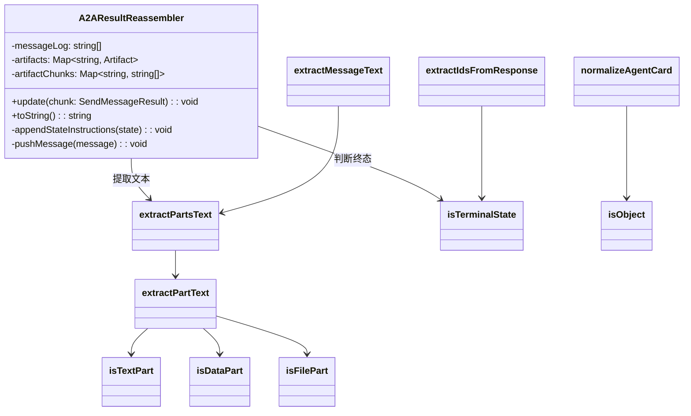

# a2aUtils.ts

> A2A 协议的工具函数集合，提供流式结果重组、消息文本提取、AgentCard 规范化和响应 ID 提取等功能。

## 概述

该文件是 A2A 远程代理通信的核心工具库，包含以下关键功能：

1. **`A2AResultReassembler` 类**：将 A2A 流式传输中的增量更新（状态更新、产物更新、任务完成等）重组为连贯的最终结果。
2. **消息文本提取**：从 A2A 消息的不同类型 Part（Text、Data、File）中提取人类可读的文本。
3. **AgentCard 规范化**：处理 A2A proto 规范与 SDK 之间的字段名别名差异。
4. **响应 ID 提取**：从流式响应中提取 `contextId` 和 `taskId`，用于维持对话连续性。

在 agents 模块中，该文件被 `a2a-client-manager.ts` 和远程调用相关模块广泛使用。

## 架构图



## 主要导出

### 常量 `AUTH_REQUIRED_MSG`

```typescript
export const AUTH_REQUIRED_MSG = `[Authorization Required] The agent has indicated it requires authorization to proceed. Please follow the agent's instructions.`;
```

当代理状态为 `auth-required` 时显示的授权提示消息。

### 类 `A2AResultReassembler`

将 A2A 流式传输的增量更新重组为连贯结果的聚合器。

#### `update(chunk: SendMessageResult): void`

处理一个新的流式数据块，按 `kind` 分发处理：
- `status-update`：记录状态消息，处理认证要求。
- `artifact-update`：追加或替换产物内容（支持增量追加模式）。
- `task`：处理任务的状态、消息、产物，并有历史记录回退逻辑。
- `message`：直接记录消息文本。

#### `toString(): string`

返回当前重组状态的人类可读字符串表示，格式为消息日志 + 产物输出。

### 函数 `extractMessageText`

```typescript
export function extractMessageText(message: Message | undefined): string
```

从 `Message` 对象中提取人类可读的文本，处理 Text、Data（JSON）、File 三种 Part 类型。

### 函数 `normalizeAgentCard`

```typescript
export function normalizeAgentCard(card: unknown): AgentCard
```

规范化 AgentCard 中的 proto 字段名别名：
- `supportedInterfaces` -> `additionalInterfaces`
- `protocolBinding` -> `transport`

这是临时的兼容处理，待 `@a2a-js/sdk` 原生支持后将移除。

### 函数 `extractIdsFromResponse`

```typescript
export function extractIdsFromResponse(result: SendMessageResult): {
  contextId?: string;
  taskId?: string;
  clearTaskId?: boolean;
}
```

从流式响应中提取 `contextId` 和 `taskId`，当任务进入终态时设置 `clearTaskId = true`。

### 函数 `isTerminalState`

```typescript
export function isTerminalState(state: TaskState | undefined): boolean
```

判断任务状态是否为终态（`completed`、`failed`、`canceled`、`rejected`）。

## 核心逻辑

### 流式结果重组

`A2AResultReassembler` 维护两个核心数据结构：
- `messageLog`：按时间顺序记录的消息文本数组（去重）。
- `artifacts` + `artifactChunks`：按 `artifactId` 索引的产物及其文本块。

**产物追加逻辑**：当 `chunk.append === true` 且已有同 ID 产物时，将新 Part 追加到现有产物；否则替换。

**历史回退逻辑**：某些代理实现不在最终响应的 `status.message` 中放置答案，而是归档到 `history` 数组中。当任务处于终态且没有其他内容时，回退读取历史中最近的 agent 消息。

### Part 文本提取

采用类型守卫（`isTextPart`、`isDataPart`、`isFilePart`）进行类型安全的分支处理：
- TextPart：直接返回 `text` 字段。
- DataPart：JSON 序列化 `data` 字段。
- FilePart：返回文件名或 URI。

## 内部依赖

| 模块 | 用途 |
|------|------|
| `./a2a-client-manager.js` | `SendMessageResult` 类型 |

## 外部依赖

| 包名 | 用途 |
|------|------|
| `@a2a-js/sdk` | A2A 协议核心类型（Message, Part, TextPart, DataPart, FilePart, Artifact, TaskState, AgentCard, AgentInterface） |
