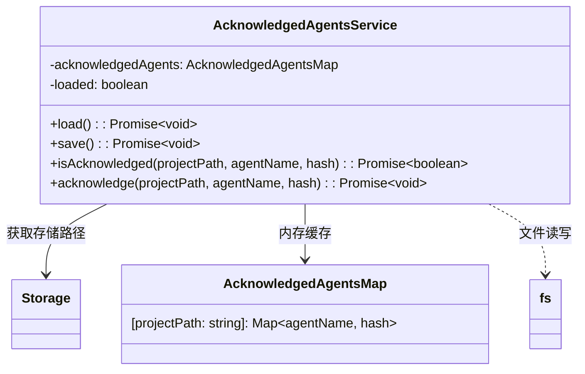

# acknowledgedAgents.ts

> 管理用户已确认（acknowledged）的代理记录，基于项目路径和代理哈希进行持久化存储。

## 概述

该文件实现了 `AcknowledgedAgentsService` 服务，用于跟踪用户已确认的代理信息。当一个代理被加载到项目中时，系统需要记录用户是否已经确认（acknowledged）过该代理的特定版本（通过哈希值标识）。这种机制可以防止未确认或已变更的代理被自动执行，保障安全性。

数据以 JSON 文件形式持久化存储，按"项目路径 -> 代理名称 -> 代理哈希"的层级结构组织。

## 架构图



## 主要导出

### 接口 `AcknowledgedAgentsMap`

```typescript
export interface AcknowledgedAgentsMap {
  [projectPath: string]: {
    [agentName: string]: string; // Agent Hash
  };
}
```

两级嵌套映射：项目路径 -> 代理名称 -> 代理哈希值。

### 类 `AcknowledgedAgentsService`

代理确认状态的管理服务。

#### `async load(): Promise<void>`

从文件系统加载已确认代理的记录。采用懒加载模式（仅首次调用时读取文件），文件不存在或解析失败时回退为空对象。

#### `async save(): Promise<void>`

将当前内存中的确认记录持久化到文件系统。自动创建所需的目录结构。

#### `async isAcknowledged(projectPath: string, agentName: string, hash: string): Promise<boolean>`

检查指定项目中的特定代理版本是否已被确认。内部会先确保数据已加载。

#### `async acknowledge(projectPath: string, agentName: string, hash: string): Promise<void>`

标记指定项目中的特定代理版本为已确认，并立即持久化。

## 核心逻辑

### 懒加载与持久化

- `load()` 方法使用 `loaded` 标志位确保文件只读取一次，后续调用直接返回。
- `save()` 方法在写入前会用 `fs.mkdir` 递归创建目录结构，确保存储路径存在。
- 读取失败时（文件不存在返回 `ENOENT`）静默回退为空对象；其他错误记录调试日志。

### 哈希比对

`isAcknowledged` 通过精确匹配哈希值来判断代理是否已确认。这意味着当代理内容发生变化（哈希变化）时，需要用户重新确认。

## 内部依赖

| 模块 | 用途 |
|------|------|
| `../config/storage.js` | `Storage.getAcknowledgedAgentsPath()` — 获取持久化文件路径 |
| `../utils/debugLogger.js` | `debugLogger` — 调试日志输出 |
| `../utils/errors.js` | `getErrorMessage`, `isNodeError` — 错误信息提取与类型判断 |

## 外部依赖

| 包名 | 用途 |
|------|------|
| `node:fs/promises` | 异步文件读写 |
| `node:path` | 路径处理（dirname） |
