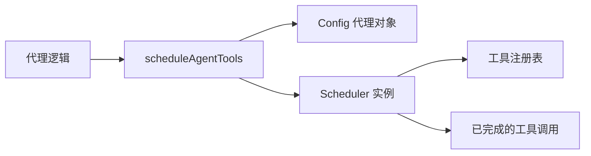

# agent-scheduler.ts

> 为代理（agent）的工具调用提供批量调度功能，将工具请求委托给事件驱动的 Scheduler。

## 概述

该文件提供了 `scheduleAgentTools` 函数，作为代理工具调用调度的入口。当一个代理需要执行一批工具调用（如文件操作、代码搜索等）时，该函数负责：

1. 创建代理专属的配置代理对象（通过原型继承覆盖工具注册表等配置）。
2. 实例化 `Scheduler` 并将工具调用请求批量提交给它。
3. 等待所有工具调用完成并返回结果。

在 agents 模块中，该文件是代理执行工具调用的桥梁层，连接了代理逻辑与底层调度系统。

## 架构图



## 主要导出

### 接口 `AgentSchedulingOptions`

```typescript
export interface AgentSchedulingOptions {
  schedulerId: string;
  subagent?: string;
  parentCallId?: string;
  toolRegistry: ToolRegistry;
  signal: AbortSignal;
  getPreferredEditor?: () => EditorType | undefined;
  onWaitingForConfirmation?: (waiting: boolean) => void;
}
```

| 字段 | 说明 |
|------|------|
| `schedulerId` | 调度器唯一 ID |
| `subagent` | 子代理名称（可选） |
| `parentCallId` | 触发该代理的父工具调用 ID（可选） |
| `toolRegistry` | 代理专属的工具注册表 |
| `signal` | 用于取消操作的 AbortSignal |
| `getPreferredEditor` | 获取首选编辑器类型的回调（可选） |
| `onWaitingForConfirmation` | 调度器等待用户确认时的通知回调（可选） |

### 函数 `scheduleAgentTools`

```typescript
export async function scheduleAgentTools(
  config: Config,
  requests: ToolCallRequestInfo[],
  options: AgentSchedulingOptions,
): Promise<CompletedToolCall[]>
```

批量调度代理的工具调用请求，返回所有完成的工具调用结果。

## 核心逻辑

### Config 代理对象创建

使用 `Object.create(config)` 创建原型继承的代理对象，在不修改原始全局配置的情况下覆盖以下属性：
- `getToolRegistry()` — 返回代理专属的工具注册表。
- `getMessageBus()` — 返回工具注册表中的消息总线。
- `toolRegistry` 属性 — 通过 `Object.defineProperty` 设置 getter，确保 `AgentLoopContext` 读取到正确的注册表。

### 调度流程

1. 解构调度选项。
2. 创建代理专属的 Config 代理对象。
3. 实例化 `Scheduler`，传入代理配置、消息总线、编辑器偏好等。
4. 调用 `scheduler.schedule(requests, signal)` 执行批量调度，等待所有工具调用完成。

## 内部依赖

| 模块 | 用途 |
|------|------|
| `../config/config.js` | `Config` 类型 — 全局运行时配置 |
| `../scheduler/scheduler.js` | `Scheduler` — 事件驱动的工具调用调度器 |
| `../scheduler/types.js` | `ToolCallRequestInfo`, `CompletedToolCall` — 调度器类型 |
| `../tools/tool-registry.js` | `ToolRegistry` — 工具注册表 |
| `../utils/editor.js` | `EditorType` — 编辑器类型 |

## 外部依赖

无。
