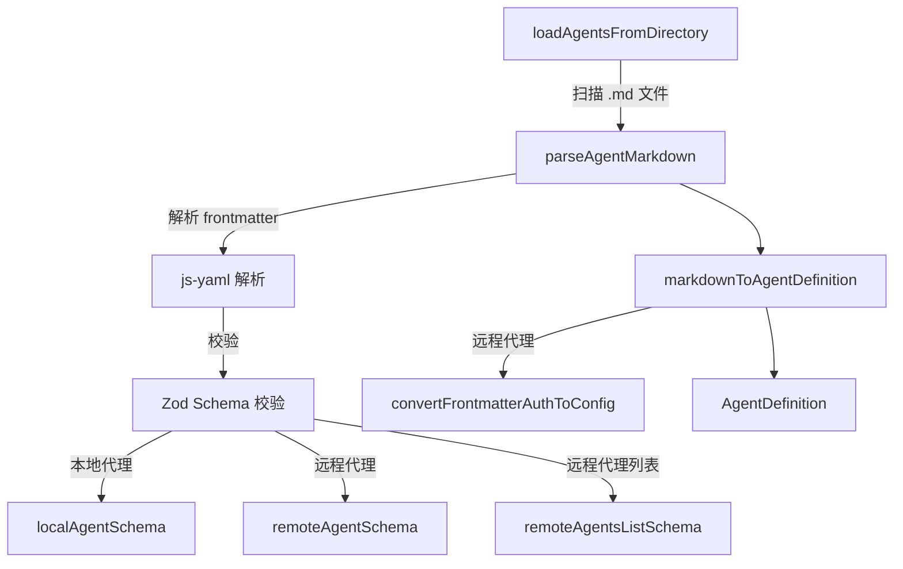

# agentLoader.ts

> 从 Markdown 文件加载和解析代理定义，支持本地代理和远程代理两种类型，包含完整的 Zod 校验逻辑。

## 概述

该文件实现了代理定义的加载管线，负责从磁盘上的 `.md` 文件中解析代理定义。每个代理定义文件使用 YAML frontmatter 声明元数据（名称、类型、工具、认证配置等），正文部分则作为本地代理的系统提示词。

主要流程为：
1. 扫描指定目录中的 `.md` 文件。
2. 解析 YAML frontmatter 并通过 Zod schema 进行校验。
3. 将 frontmatter DTO 转换为内部 `AgentDefinition` 结构。
4. 为每个文件计算 SHA-256 哈希值，用于变更检测。

该文件是代理注册系统（registry）的上游数据源。

## 架构图



## 主要导出

### 类 `AgentLoadError`

```typescript
export class AgentLoadError extends Error {
  constructor(public filePath: string, message: string)
}
```

当代理定义无效或无法加载时抛出的专用错误，携带文件路径信息。

### 接口 `AgentLoadResult`

```typescript
export interface AgentLoadResult {
  agents: AgentDefinition[];
  errors: AgentLoadError[];
}
```

目录加载结果，包含成功加载的代理列表和遇到的错误列表（不因单个文件失败而中断整个加载过程）。

### 函数 `parseAgentMarkdown`

```typescript
export async function parseAgentMarkdown(
  filePath: string,
  content?: string,
): Promise<FrontmatterAgentDefinition[]>
```

解析代理 Markdown 文件：
1. 提取 YAML frontmatter。
2. 使用 `js-yaml` 解析。
3. 通过 Zod schema 校验（支持单个代理或远程代理数组）。
4. 本地代理的系统提示词取自 Markdown 正文。

### 函数 `markdownToAgentDefinition`

```typescript
export function markdownToAgentDefinition(
  markdown: FrontmatterAgentDefinition,
  metadata?: { hash?: string; filePath?: string },
): AgentDefinition
```

将 frontmatter DTO 转换为内部 `AgentDefinition` 结构：
- **远程代理**：转换认证配置（通过 `convertFrontmatterAuthToConfig`），设置 `agentCardUrl`。
- **本地代理**：设置模型配置（默认继承）、运行配置（最大轮数、超时）、工具配置、系统提示词。

### 函数 `loadAgentsFromDirectory`

```typescript
export async function loadAgentsFromDirectory(dir: string): Promise<AgentLoadResult>
```

从目录加载所有代理：
- 过滤以 `_` 开头的文件和非 `.md` 文件。
- 为每个文件计算 SHA-256 哈希值。
- 收集所有错误但不中断加载过程。

## 核心逻辑

### Zod 校验体系

文件定义了丰富的 Zod schema 层次：

- **`nameSchema`**：代理名称必须为 slug 格式（`[a-z0-9-_]+`）。
- **`localAgentSchema`**：本地代理需要 `description`、可选的 `tools`（需通过 `isValidToolName` 校验）、`model`、`temperature`、`max_turns`、`timeout_mins`。
- **`remoteAgentSchema`**：远程代理需要 `agent_card_url`（必须是合法 URL），可选 `auth`。
- **`authConfigSchema`**：使用 `discriminatedUnion` 按 `type` 区分四种认证类型（apiKey、http、google-credentials、oauth2），并对 HTTP 认证使用 `superRefine` 校验 Bearer/Basic 的必填字段。

### 认证配置转换

`convertFrontmatterAuthToConfig` 使用穷举式 switch 将 frontmatter 认证配置映射到内部 `A2AAuthConfig` 类型：
- `apiKey`：需要 `key` 字段。
- `http`：支持 Bearer（token）、Basic（username/password）、Raw（value）三种模式。
- `google-credentials`：可选 `scopes`。
- `oauth2`：可选 `client_id`、`client_secret`、`scopes`、URL。

### 错误格式化

`formatZodError` 专门处理 Zod union 类型的错误信息，为每个候选类型生成带标签的详细错误说明。

## 内部依赖

| 模块 | 用途 |
|------|------|
| `./types.js` | `AgentDefinition`, `DEFAULT_MAX_TURNS`, `DEFAULT_MAX_TIME_MINUTES` |
| `./auth-provider/types.js` | `A2AAuthConfig` 类型 |
| `../tools/tool-names.js` | `isValidToolName` — 工具名称校验 |
| `../skills/skillLoader.js` | `FRONTMATTER_REGEX` — frontmatter 正则 |
| `../utils/errors.js` | `getErrorMessage` — 错误信息提取 |

## 外部依赖

| 包名 | 用途 |
|------|------|
| `js-yaml` | YAML frontmatter 解析 |
| `node:fs/promises` | 异步文件/目录读取 |
| `node:path` | 路径拼接 |
| `node:crypto` | SHA-256 哈希计算 |
| `zod` | Schema 校验 |
