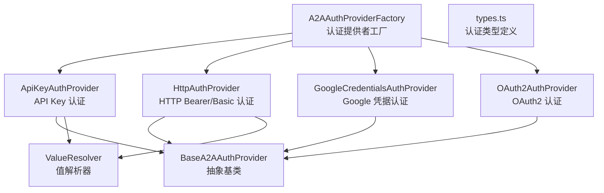

# auth-provider 架构

> A2A 远程 Agent 的认证提供者系统，支持 API Key、HTTP、Google Credentials 和 OAuth2 四种认证方式

## 概述

`auth-provider/` 模块为 A2A（Agent-to-Agent）远程 Agent 提供认证能力。当 Gemini CLI 需要调用远程 Agent 时，该模块负责根据配置和 Agent Card 的安全方案要求，创建合适的认证提供者，自动注入认证头信息。采用工厂模式（`A2AAuthProviderFactory`）统一创建不同类型的认证提供者。

## 架构图



## 目录结构

```
auth-provider/
├── types.ts                         # 认证配置类型定义
├── factory.ts                       # A2AAuthProviderFactory 工厂类
├── base-provider.ts                 # BaseA2AAuthProvider 抽象基类
├── api-key-provider.ts              # API Key 认证实现
├── http-provider.ts                 # HTTP 认证实现（Bearer/Basic/自定义）
├── google-credentials-provider.ts   # Google ADC 凭据认证
├── oauth2-provider.ts               # OAuth2 认证流程
└── value-resolver.ts                # 值解析器（环境变量、命令执行、字面量）
```

## 关键文件

| 文件 | 功能 |
|------|------|
| `types.ts` | 定义 `A2AAuthConfig` 联合类型（5 种认证配置）、`A2AAuthProvider` 接口、`AuthValidationResult` |
| `factory.ts` | `A2AAuthProviderFactory`：创建认证提供者、验证配置与 AgentCard 安全方案的匹配、生成人类可读的认证描述 |
| `base-provider.ts` | `BaseA2AAuthProvider` 抽象类：实现 `AuthenticationHandler` 接口，提供默认的 401/403 重试逻辑（最多 2 次） |
| `value-resolver.ts` | 值解析器：支持 `$ENV_VAR`（环境变量）、`!command`（命令执行）和字面量三种值来源 |

## 内部依赖

- `mcp/oauth-token-storage.ts` - OAuth2 Token 存储（动态导入以避免循环依赖）
- `utils/debugLogger.ts` - 调试日志
- `utils/errors.ts` - 错误处理

## 外部依赖

| 依赖 | 用途 |
|------|------|
| `@a2a-js/sdk` | `SecurityScheme`、`AgentCard` 类型 |
| `@a2a-js/sdk/client` | `AuthenticationHandler`、`HttpHeaders` 接口 |
| `google-auth-library` | Google ADC（Application Default Credentials）认证 |
