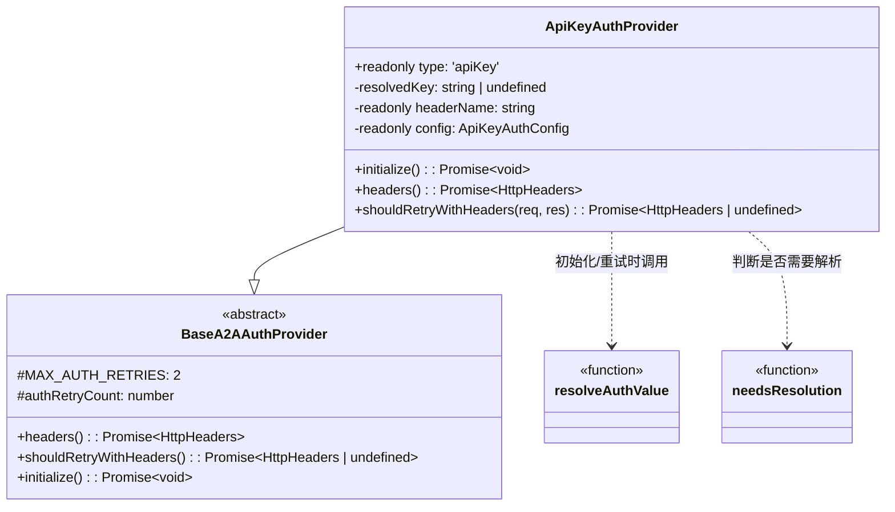

# api-key-provider.ts

> API Key 认证提供者，通过 HTTP Header 发送 API 密钥

## 概述

`api-key-provider.ts` 实现了基于 API Key 的认证策略。它将 API Key 作为 HTTP 请求头发送（默认 `X-API-Key`），支持三种密钥来源：字面量字符串、环境变量引用（`$ENV_VAR`）和 Shell 命令（`!command`）。

在模块中的角色：作为 `A2AAuthProviderFactory` 工厂可创建的四种 Provider 之一，对应 A2A 规范中的 `APIKeySecurityScheme`。

## 架构图



## 主要导出

### `ApiKeyAuthProvider` (class)

```typescript
class ApiKeyAuthProvider extends BaseA2AAuthProvider {
  readonly type = 'apiKey';
  constructor(config: ApiKeyAuthConfig);
  override async initialize(): Promise<void>;
  async headers(): Promise<HttpHeaders>;
  override async shouldRetryWithHeaders(_req: RequestInit, res: Response): Promise<HttpHeaders | undefined>;
}
```

| 方法 | 说明 |
|------|------|
| `constructor(config)` | 接收 `ApiKeyAuthConfig`，从配置中读取 Header 名称（默认 `X-API-Key`） |
| `initialize()` | 如果 key 值需要解析（`$` 或 `!` 开头），调用 `resolveAuthValue` 解析；否则直接使用字面量 |
| `headers()` | 返回 `{ [headerName]: resolvedKey }` 形式的 HTTP 头。未初始化时抛出异常 |
| `shouldRetryWithHeaders()` | 覆盖基类方法，仅对命令来源（`!command`）的 Key 在认证失败时重新解析。字面量和环境变量来源不会重试（值不会变化） |

## 核心逻辑

### 初始化流程

```
needsResolution(config.key)?
  |-- 是 --> resolveAuthValue(config.key) --> 存入 this.resolvedKey
  |-- 否 --> 直接将 config.key 赋给 this.resolvedKey
```

### 智能重试策略

认证失败（401/403）时的重试逻辑经过精心设计：

1. **字面量 Key**：不重试（同一个 Key 重发无意义）
2. **环境变量 Key**（`$ENV_VAR`）：不重试（同一进程内环境变量不会变）
3. **命令 Key**（`!command`）：重新执行命令获取新 Key（命令可能返回旋转后的凭据）
4. **转义命令**（`!!command`，即字面量 `!command`）：不重试

判断逻辑：
```typescript
if (!this.config.key.startsWith('!') || this.config.key.startsWith('!!')) {
  return undefined; // 不重试
}
```

## 内部依赖

| 模块 | 导入内容 | 用途 |
|------|---------|------|
| `./base-provider.js` | `BaseA2AAuthProvider` | 继承的抽象基类 |
| `./types.js` | `ApiKeyAuthConfig` (type) | 配置类型定义 |
| `./value-resolver.js` | `resolveAuthValue`, `needsResolution` | 动态值解析 |
| `../../utils/debugLogger.js` | `debugLogger` | 调试日志 |

## 外部依赖

| 包名 | 导入内容 | 用途 |
|------|---------|------|
| `@a2a-js/sdk/client` | `HttpHeaders` (type) | HTTP 请求头类型（通过基类间接使用） |
