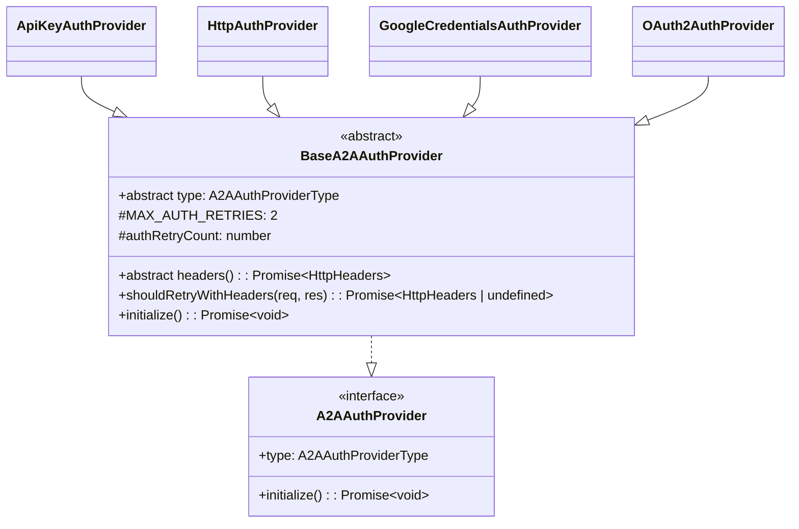

# base-provider.ts

> A2A 认证提供者的抽象基类，提供默认的重试与初始化逻辑

## 概述

`base-provider.ts` 定义了 `BaseA2AAuthProvider` 抽象类，是所有具体认证提供者（ApiKey、Http、GoogleCredentials、OAuth2）的父类。它实现了 `A2AAuthProvider` 接口，并提供了认证失败后的默认重试机制（401/403 响应时自动刷新凭据，最多重试 2 次）和空操作的默认 `initialize()` 方法。

设计动机：将通用的重试逻辑和初始化框架提升到基类，避免各 Provider 重复实现，同时允许子类按需覆盖。

## 架构图



## 主要导出

### `BaseA2AAuthProvider` (abstract class)

```typescript
abstract class BaseA2AAuthProvider implements A2AAuthProvider {
  abstract readonly type: A2AAuthProviderType;
  abstract headers(): Promise<HttpHeaders>;
  protected static readonly MAX_AUTH_RETRIES = 2;
  protected authRetryCount = 0;
  async shouldRetryWithHeaders(_req: RequestInit, res: Response): Promise<HttpHeaders | undefined>;
  async initialize(): Promise<void>;
}
```

| 成员 | 说明 |
|------|------|
| `type` | 抽象属性，子类必须声明具体的认证类型 |
| `headers()` | 抽象方法，子类实现返回认证 HTTP 请求头 |
| `MAX_AUTH_RETRIES` | 静态常量，认证重试上限为 2 次 |
| `authRetryCount` | 受保护的计数器，跟踪当前重试次数 |
| `shouldRetryWithHeaders()` | 检查响应是否为 401/403，若未超过重试上限则返回新的认证头供重试 |
| `initialize()` | 默认空操作，供需要异步初始化的子类覆盖 |

## 核心逻辑

### 重试机制

```
收到 HTTP 响应
  |
  v
状态码 == 401 或 403？
  |-- 否 --> 重置 authRetryCount 为 0，返回 undefined（不重试）
  |-- 是 --> authRetryCount >= MAX_AUTH_RETRIES？
               |-- 是 --> 返回 undefined（停止重试）
               |-- 否 --> authRetryCount++，调用 this.headers() 返回新凭据
```

关键设计点：
- 非认证错误时重置计数器，允许后续请求再次享有完整的重试配额。
- 默认实现直接调用 `this.headers()` 获取新凭据。子类可覆盖此方法以实现更复杂的刷新逻辑（如 OAuth2 的 token 刷新、ApiKey 的命令重新执行等）。

## 内部依赖

| 模块 | 导入内容 | 用途 |
|------|---------|------|
| `./types.js` | `A2AAuthProvider`, `A2AAuthProviderType` (types) | 实现的接口和类型标识 |

## 外部依赖

| 包名 | 导入内容 | 用途 |
|------|---------|------|
| `@a2a-js/sdk/client` | `HttpHeaders` (type) | HTTP 请求头的类型定义 |
