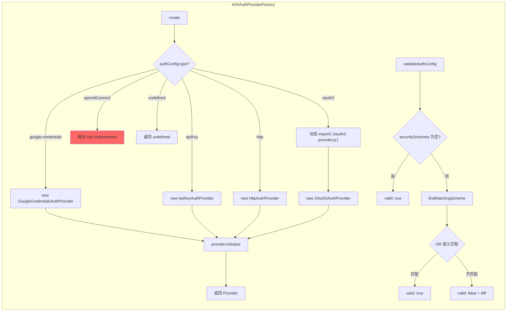

# factory.ts

> A2A 认证提供者工厂，负责创建、校验和描述认证策略

## 概述

`factory.ts` 是 `auth-provider` 模块的核心入口，通过 `A2AAuthProviderFactory` 工厂类统一管理所有认证提供者的创建。它同时承担三项职责：

1. **创建**：根据 `A2AAuthConfig.type` 分发创建对应的 Provider 实例
2. **校验**：将用户配置与 Agent Card 的安全要求进行匹配验证
3. **描述**：生成人类可读的安全要求描述，用于错误提示

设计动机：将 Provider 选择逻辑集中到工厂方法中，配合 TypeScript 的穷举检查确保每种认证类型都得到处理，同时通过 `CreateAuthProviderOptions` 将各 Provider 所需的不同参数统一传递。

## 架构图



## 主要导出

### `CreateAuthProviderOptions` (interface)

```typescript
interface CreateAuthProviderOptions {
  agentName?: string;      // 用于 OAuth/OIDC Token 存储
  authConfig?: A2AAuthConfig;  // 用户认证配置
  agentCard?: AgentCard;   // Agent Card（含安全方案）
  targetUrl?: string;      // 目标 URL（google-credentials 需要）
  agentCardUrl?: string;   // Agent Card URL（OAuth2 URL 发现需要）
}
```

### `A2AAuthProviderFactory` (class)

```typescript
class A2AAuthProviderFactory {
  static async create(options: CreateAuthProviderOptions): Promise<A2AAuthProvider | undefined>;
  static async createFromConfig(authConfig: A2AAuthConfig, agentName?: string): Promise<A2AAuthProvider>;
  static validateAuthConfig(authConfig: A2AAuthConfig | undefined, securitySchemes: Record<string, SecurityScheme> | undefined): AuthValidationResult;
  static describeRequiredAuth(securitySchemes: Record<string, SecurityScheme>): string;
}
```

| 方法 | 说明 |
|------|------|
| `create()` | 主工厂方法。根据配置类型创建并初始化 Provider。无配置时返回 `undefined` |
| `createFromConfig()` | 便捷方法，直接从配置创建（绕过 Agent Card 校验） |
| `validateAuthConfig()` | 校验配置是否满足 Agent Card 的安全要求 |
| `describeRequiredAuth()` | 将安全方案转换为人类可读的描述文本 |

## 核心逻辑

### Provider 创建流程

每种类型的创建都遵循 `new → initialize → return` 模式。关键设计点：

- **OAuth2 动态导入**：使用 `await import('./oauth2-provider.js')` 而非静态导入，避免 `MCPOAuthTokenStorage` 进入工厂的静态模块图，解决与 `code_assist/oauth-credential-storage.ts` 的初始化冲突。
- **穷举检查**：`default` 分支使用 `const _exhaustive: never = authConfig` 确保编译期捕获未处理的新类型。
- **openIdConnect**：标记为 TODO，调用时抛出异常。

### 安全方案匹配算法（OR 语义）

A2A 规范要求 `securitySchemes` 中的多个方案之间是 OR 关系——匹配任一方案即可。

`findMatchingScheme` 的逻辑：
1. 遍历所有 `securitySchemes`
2. 对每个方案检查 `authConfig.type` 是否匹配
3. **特殊处理**：`google-credentials` 类型可匹配 `http` + `Bearer` 方案（因为 Google ADC 最终也是发送 Bearer Token）
4. **HTTP scheme 校验**：不仅检查类型匹配，还比较具体的 scheme（如 Bearer vs Basic）
5. 找到第一个匹配即返回 `{ matched: true }`
6. 全部不匹配则收集所有 `missingConfig` 描述返回

### 安全方案描述

`describeRequiredAuth` 将方案转为可读文本，各方案间用 ` OR ` 连接：
```
API Key (api_key_scheme): Send X-API-Key in header OR HTTP Bearer (jwt_scheme)
```

## 内部依赖

| 模块 | 导入内容 | 用途 |
|------|---------|------|
| `./types.js` | `A2AAuthConfig`, `A2AAuthProvider`, `AuthValidationResult` (types) | 类型定义 |
| `./api-key-provider.js` | `ApiKeyAuthProvider` | API Key Provider 构造 |
| `./http-provider.js` | `HttpAuthProvider` | HTTP Provider 构造 |
| `./google-credentials-provider.js` | `GoogleCredentialsAuthProvider` | Google ADC Provider 构造 |
| `./oauth2-provider.js` | `OAuth2AuthProvider`（动态导入） | OAuth2 Provider 构造 |

## 外部依赖

| 包名 | 导入内容 | 用途 |
|------|---------|------|
| `@a2a-js/sdk` | `AgentCard`, `SecurityScheme` (types) | Agent Card 和安全方案类型定义 |
