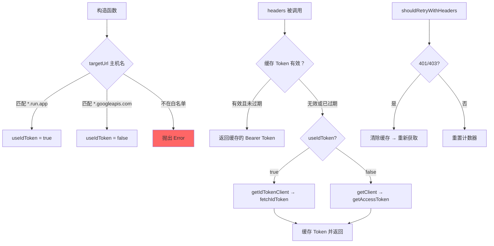

# google-credentials-provider.ts

> Google ADC（应用默认凭据）认证提供者，自动选择 ID Token 或 Access Token

## 概述

`google-credentials-provider.ts` 实现了基于 Google Application Default Credentials (ADC) 的认证策略。这是 Gemini CLI 特有的认证方式（非 A2A 标准），根据目标 URL 的主机名自动决定使用 ID Token（Cloud Run 服务）或 Access Token（googleapis.com 等 Google API）。

设计动机：简化 Google 生态系统内的认证体验——用户只需指定 `type: 'google-credentials'`，Provider 自动处理 Token 类型选择、缓存和刷新。

## 架构图



## 主要导出

### `GoogleCredentialsAuthProvider` (class)

```typescript
class GoogleCredentialsAuthProvider extends BaseA2AAuthProvider {
  readonly type = 'google-credentials';
  constructor(config: GoogleCredentialsAuthConfig, targetUrl?: string);
  override async initialize(): Promise<void>;
  async headers(): Promise<HttpHeaders>;
  override async shouldRetryWithHeaders(_req: RequestInit, res: Response): Promise<HttpHeaders | undefined>;
}
```

| 方法 | 说明 |
|------|------|
| `constructor` | 解析 `targetUrl` 的主机名，决定 Token 类型；校验主机白名单；创建 `GoogleAuth` 实例 |
| `initialize()` | 当前为空操作，采用延迟获取策略 |
| `headers()` | 返回 `Authorization: Bearer <token>`。实现了内存缓存（提前 5 分钟过期） |
| `shouldRetryWithHeaders()` | 清除缓存强制重新获取 Token |

## 核心逻辑

### 主机白名单与 Token 类型选择

| 主机模式 | Token 类型 | 说明 |
|---------|-----------|------|
| `*.run.app` | ID Token | Cloud Run 服务需要 ID Token 认证 |
| `*.googleapis.com` | Access Token | Google API 使用 OAuth Access Token |
| 其他 | 拒绝 | 抛出安全错误，防止凭据泄露到非 Google 服务 |

白名单通过正则表达式实现：
```typescript
const CLOUD_RUN_HOST_REGEX = /^(.*\.)?run\.app$/;
const ALLOWED_HOSTS = [/^.+\.googleapis\.com$/, CLOUD_RUN_HOST_REGEX];
```

### Token 缓存机制

- 缓存在 `cachedToken` 和 `tokenExpiryTime` 字段中
- 使用 `FIVE_MIN_BUFFER_MS`（来自 `oauth-utils`）提前 5 分钟使缓存失效
- ID Token 的过期时间通过 `OAuthUtils.parseTokenExpiry()` 解析 JWT 获取
- Access Token 的过期时间从 `client.credentials.expiry_date` 获取

### ID Token vs Access Token 获取路径

**ID Token 路径**（Cloud Run）：
```
GoogleAuth.getIdTokenClient(audience) → idClient.idTokenProvider.fetchIdToken(audience)
```

**Access Token 路径**（googleapis.com）：
```
GoogleAuth.getClient() → client.getAccessToken()
```

### 重试机制

覆盖基类的 `shouldRetryWithHeaders`：
1. 清除 `cachedToken` 和 `tokenExpiryTime`
2. 重新调用 `this.headers()` 获取全新 Token
3. 遵守 `MAX_AUTH_RETRIES` 限制

## 内部依赖

| 模块 | 导入内容 | 用途 |
|------|---------|------|
| `./base-provider.js` | `BaseA2AAuthProvider` | 继承的抽象基类 |
| `./types.js` | `GoogleCredentialsAuthConfig` (type) | 配置类型 |
| `../../utils/debugLogger.js` | `debugLogger` | 调试/错误日志 |
| `../../mcp/oauth-utils.js` | `OAuthUtils`, `FIVE_MIN_BUFFER_MS` | JWT 过期时间解析和缓存提前失效常量 |

## 外部依赖

| 包名 | 导入内容 | 用途 |
|------|---------|------|
| `@a2a-js/sdk/client` | `HttpHeaders` (type) | HTTP 请求头类型 |
| `google-auth-library` | `GoogleAuth` | Google ADC 库，处理凭据发现和 Token 获取 |
