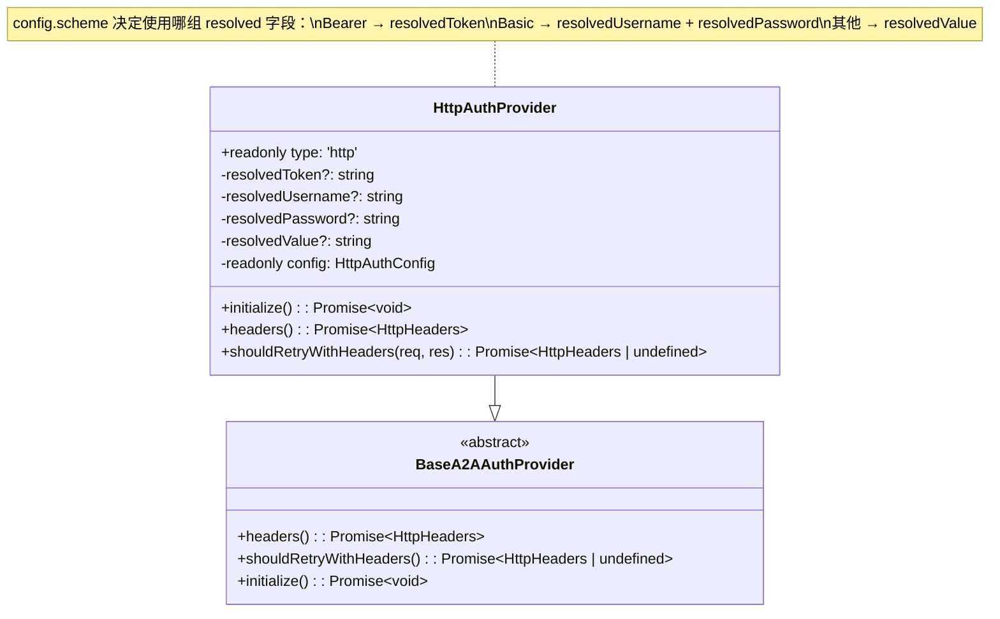

# http-provider.ts

> HTTP 认证方案提供者，支持 Bearer、Basic 及任意 IANA 注册方案

## 概述

`http-provider.ts` 实现了基于 HTTP Authentication 标准的认证策略，对应 A2A 规范中的 `HTTPAuthSecurityScheme`。通过 `Authorization` 请求头发送凭据，支持三种 scheme 变体：

- **Bearer**：`Authorization: Bearer <token>`
- **Basic**：`Authorization: Basic <base64(username:password)>`
- **通用方案**：`Authorization: <scheme> <value>`（如 Digest、HOBA 等）

所有凭据值均通过 `value-resolver` 支持 `$ENV_VAR`、`!command` 和字面量。

## 架构图



## 主要导出

### `HttpAuthProvider` (class)

```typescript
class HttpAuthProvider extends BaseA2AAuthProvider {
  readonly type = 'http';
  constructor(config: HttpAuthConfig);
  override async initialize(): Promise<void>;
  override async headers(): Promise<HttpHeaders>;
  override async shouldRetryWithHeaders(req: RequestInit, res: Response): Promise<HttpHeaders | undefined>;
}
```

| 方法 | 说明 |
|------|------|
| `initialize()` | 根据配置中的 scheme 类型，解析对应的凭据字段（token / username+password / value） |
| `headers()` | 构建 `Authorization` 请求头。Bearer 直接拼接 token，Basic 进行 Base64 编码，通用方案使用 `<scheme> <value>` |
| `shouldRetryWithHeaders()` | 认证失败时重新调用 `initialize()` 解析所有凭据（适用于凭据轮转场景），然后委托基类处理重试计数 |

## 核心逻辑

### 初始化时的 scheme 分发

通过 TypeScript 的类型窄化（`'token' in config`、`'username' in config`）判断当前 scheme 变体：

```
config 中包含 'token'？ → resolveAuthValue(config.token)     → Bearer 模式
config 中包含 'username'？ → 解析 username 和 password        → Basic 模式
否则                      → resolveAuthValue(config.value)    → 通用 IANA 模式
```

### headers() 输出格式

| Scheme | 输出 |
|--------|------|
| Bearer | `Authorization: Bearer eyJhbG...` |
| Basic  | `Authorization: Basic dXNlcjpwYXNz` |
| 自定义 | `Authorization: Digest abc123` |

### 重试策略

与 `ApiKeyAuthProvider` 不同，`HttpAuthProvider` 在认证失败时始终重新解析所有凭据（无论来源是字面量、环境变量还是命令）。这是因为 HTTP 认证场景下凭据轮转更常见，且 `initialize()` 内部已经封装了完整的解析逻辑。

调用链：`shouldRetryWithHeaders()` -> `this.initialize()` -> `super.shouldRetryWithHeaders()`

## 内部依赖

| 模块 | 导入内容 | 用途 |
|------|---------|------|
| `./base-provider.js` | `BaseA2AAuthProvider` | 继承的抽象基类 |
| `./types.js` | `HttpAuthConfig` (type) | 配置类型定义 |
| `./value-resolver.js` | `resolveAuthValue` | 动态值解析 |
| `../../utils/debugLogger.js` | `debugLogger` | 调试日志 |

## 外部依赖

| 包名 | 导入内容 | 用途 |
|------|---------|------|
| `@a2a-js/sdk/client` | `HttpHeaders` (type) | HTTP 请求头类型 |

> 注意：`Buffer.from().toString('base64')` 为 Node.js 内置 API，用于 Basic 认证的 Base64 编码。
