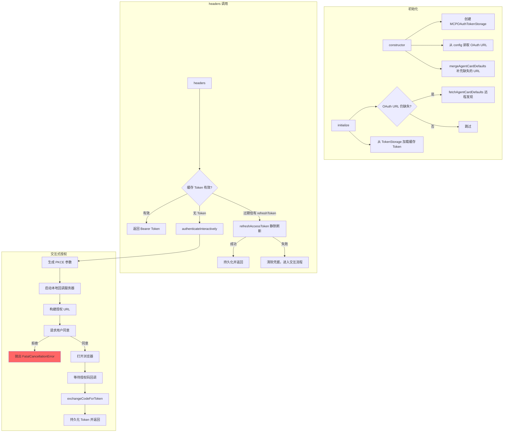

# oauth2-provider.ts

> OAuth 2.0 Authorization Code + PKCE 流程认证提供者，支持交互式浏览器授权

## 概述

`oauth2-provider.ts` 实现了完整的 OAuth 2.0 Authorization Code 流程（带 PKCE），用于 A2A 远程代理的 `oauth2` 安全方案。它是模块中最复杂的 Provider，涵盖了 Token 持久化、静默刷新、交互式浏览器授权、Agent Card 的 OAuth URL 自动发现等完整的 OAuth 生命周期。

设计动机：OAuth 2.0 流程涉及多个异步步骤和外部交互（浏览器、回调服务器、Token 端点），将这些逻辑封装在单一 Provider 中，对外暴露与其他 Provider 一致的 `headers()` 接口。

注意：该模块通过 `factory.ts` 的动态 `import()` 加载，避免静态模块图中的循环依赖。

## 架构图



## 主要导出

### `OAuth2AuthProvider` (class)

```typescript
class OAuth2AuthProvider extends BaseA2AAuthProvider {
  readonly type = 'oauth2';
  constructor(config: OAuth2AuthConfig, agentName: string, agentCard?: AgentCard, agentCardUrl?: string);
  override async initialize(): Promise<void>;
  override async headers(): Promise<HttpHeaders>;
  override async shouldRetryWithHeaders(_req: RequestInit, res: Response): Promise<HttpHeaders | undefined>;
}
```

| 方法 | 说明 |
|------|------|
| `constructor` | 初始化 Token 存储路径、从用户配置和 Agent Card 合并 OAuth URL/scopes |
| `initialize()` | 远程发现缺失的 OAuth URL；从磁盘加载已持久化的 Token |
| `headers()` | 三级策略：缓存 Token -> 静默 Refresh -> 交互式浏览器授权 |
| `shouldRetryWithHeaders()` | 清除缓存 Token 和磁盘凭据，重新触发完整认证流程 |

## 核心逻辑

### OAuth URL 发现机制（三级回退）

1. **用户配置**：`config.authorization_url` 和 `config.token_url`（最高优先级）
2. **Agent Card（本地）**：构造函数中通过 `mergeAgentCardDefaults()` 从传入的 `agentCard.securitySchemes` 中提取 `oauth2` 方案的 `authorizationCode` 流的 URL
3. **Agent Card（远程）**：`initialize()` 中通过 `DefaultAgentCardResolver` 从 `agentCardUrl` 远程获取 Agent Card

使用 `??=` 运算符确保只补充缺失字段，不覆盖用户显式配置。

### Token 获取三级策略

```
1. 缓存 Token 未过期？ → 直接返回
2. 有 refreshToken + tokenUrl + clientId？ → refreshAccessToken() 静默刷新
   2a. 刷新成功 → 持久化并返回
   2b. 刷新失败 → 清除磁盘凭据，继续步骤 3
3. authenticateInteractively() → 完整的 PKCE 浏览器授权流程
```

### 交互式授权流程

1. 校验 `client_id`、`authorizationUrl`、`tokenUrl` 必须存在
2. `generatePKCEParams()` 生成 `state`、`codeVerifier`、`codeChallenge`
3. `startCallbackServer()` 启动本地 HTTP 服务器监听授权码回调
4. `buildAuthorizationUrl()` 拼接完整的授权请求 URL
5. `getConsentForOauth()` 请求用户确认（拒绝则抛出 `FatalCancellationError`）
6. `openBrowserSecurely()` 打开系统浏览器
7. 等待回调服务器接收授权码
8. `exchangeCodeForToken()` 用授权码换取 Token
9. `persistToken()` 持久化到磁盘

### Token 持久化

通过 `MCPOAuthTokenStorage` 管理，存储路径为 `Storage.getA2AOAuthTokensPath()`，key 前缀 `gemini-cli-a2a`。每次成功获取或刷新 Token 后调用 `saveToken()`。

### toOAuthToken 转换

将 OAuth 标准响应转换为内部 `OAuthToken` 格式：
- `access_token` -> `accessToken`
- `expires_in` -> `expiresAt`（计算绝对过期时间戳）
- 支持 `fallbackRefreshToken` 参数，刷新场景下保留原 refresh token

## 内部依赖

| 模块 | 导入内容 | 用途 |
|------|---------|------|
| `./base-provider.js` | `BaseA2AAuthProvider` | 继承的抽象基类 |
| `./types.js` | `OAuth2AuthConfig` (type) | 配置类型 |
| `../../mcp/oauth-token-storage.js` | `MCPOAuthTokenStorage` | Token 持久化存储 |
| `../../mcp/token-storage/types.js` | `OAuthToken` (type) | Token 数据结构 |
| `../../utils/oauth-flow.js` | `generatePKCEParams`, `startCallbackServer`, `getPortFromUrl`, `buildAuthorizationUrl`, `exchangeCodeForToken`, `refreshAccessToken`, `OAuthFlowConfig` (type) | OAuth 流程工具函数 |
| `../../utils/secure-browser-launcher.js` | `openBrowserSecurely` | 安全启动浏览器 |
| `../../utils/authConsent.js` | `getConsentForOauth` | 用户授权确认 |
| `../../utils/errors.js` | `FatalCancellationError`, `getErrorMessage` | 错误处理 |
| `../../utils/events.js` | `coreEvents` | 事件总线，发送用户反馈 |
| `../../utils/debugLogger.js` | `debugLogger` | 调试日志 |
| `../../config/storage.js` | `Storage` | 获取 Token 存储路径 |

## 外部依赖

| 包名 | 导入内容 | 用途 |
|------|---------|------|
| `@a2a-js/sdk/client` | `HttpHeaders` (type), `DefaultAgentCardResolver` | HTTP 头类型；远程获取并解析 Agent Card |
| `@a2a-js/sdk` | `AgentCard` (type) | Agent Card 数据结构 |
